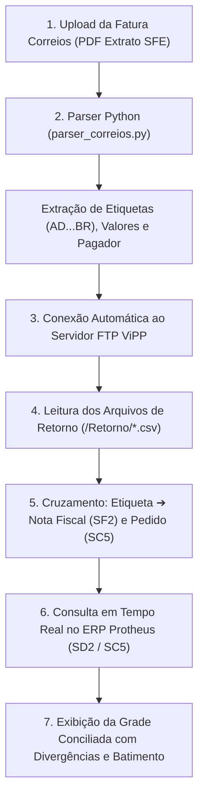

# 📌 Documento de Checkpoint & Ponto de Parada 7: Aba 2 (Fatura Correios & Integração FTP ViPP)

> **Projeto:** Portal de Conciliação de Fretes & ERP Protheus Multi-Empresas  
> **Módulo:** 2ª Aba — Fatura Correios SFE & Automação de Retorno ViPP VisualSet  
> **Data do Registro:** 17 de Agosto de 2026  
> **Status:** 🟢 **CANAL FTP HOMOLOGADO / AGUARDANDO ARQUIVO DE RETORNO DO VIPP**  

---

## 1. 🎯 Fluxo Operacional e Arquitetura Definida

Ficou estabelecido que o fluxo de conciliação da **Aba 2 (Correios)** funcionará da seguinte forma:

### **Passo a Passo do Processamento:**
1. **Upload da Fatura SFE:** O operador envia o PDF analítico emitido pelos Correios (ex: `Exemplo_CORREIO_OACO.pdf`).
2. **Extração das Postagens:** O parser extrai 100% das etiquetas de rastreamento (`AD...BR`, `AP...BR`), datas de postagem, serviços (`SEDEX`/`PAC`), pesos tarifados e valores cobrados pelos Correios.
3. **Consulta Automática ao FTP:** O backend conecta-se ao FTP da ViPP, acessa o diretório `/Retorno` e localiza o arquivo correspondente (formato CSV/TXT).
4. **Resolução de Chaves:** O sistema vincula cada etiqueta ao número da **Nota Fiscal de Saída (`D2_DOC`)** e **Pedido de Venda (`C5_NUM`)**.
5. **Batimento no Protheus:** Com as NFs identificadas, o sistema executa a query SQL nas tabelas correspondentes da empresa (**OACO 16**, **GSI 15** ou **Metal Pleno 14**), comparando o frete cobrado do cliente (`C5_FRETE + C5_VLR_FRT`) com o valor cobrado pelos Correios.

---

## 2. 🔐 Dados de Acesso ao Servidor FTP ViPP (Homologados)

Os testes de autenticação e navegação foram executados e aprovados com sucesso em 17/08/2026:

| Parâmetro | Configuração Oficial |
| :--- | :--- |
| **Endereço FTP (Host)** | `ftp://vipp.visualset.com.br/` (Porta 21) |
| **Serviço FTP** | Pure-FTPd (com suporte a TLS) |
| **Login / Usuário** | `vipp_003070` |
| **Senha** | `123456vs` |
| **Modo de Transferência** | Modo Passivo (`PASV = True`) |
| **Pasta de Retorno** | `/Retorno` |
| **Status da Conexão** | ✅ **100% Testado e Operacional** |

---

## 3. ⚙️ Entregas e Componentes Já Construídos

1. **Parser Nativo PDF Correios SFE ([`parser_correios.py`](file:///C:/Users/Alexandre/Documents/Gemini-Cli/parser_correios.py)):**
   - Leitura completa de faturas analíticas multi-páginas.
   - Reconhecimento automático do pagador por CNPJ/Razão Social:
     - **OACO (Empresa 16):** CNPJ `61.237.790/0001-18`
     - **GSI COFRES / BW (Empresa 15):** CNPJ `00.867.784/0001-51`
     - **METAL PLENO (Empresa 14):** CNPJ `10.870.367/0001-44`
2. **Script de Teste de Conexão FTP:**
   - Rotina em Python com `ftplib` para autenticação e listagem da pasta `/Retorno`.
3. **Backend Express ([`server.js`](file:///C:/Users/Alexandre/Documents/Gemini-Cli/server.js)):**
   - Endpoints `/api/upload` e `/api/sample-correios` estruturados.
4. **Interface do Usuário ([`public/index.html`](file:///C:/Users/Alexandre/Documents/Gemini-Cli/public/index.html) e [`public/app.js`](file:///C:/Users/Alexandre/Documents/Gemini-Cli/public/app.js)):**
   - Sub-aba *"Fatura Correios & ViPP"* na 1ª Aba Principal (**📦 LOGÍSTICA**).

---

## 4. 🛑 Registro do Ponto de Parada 7

* **Estado Atual:** A conexão FTP está validada e pronta para consumo. A pasta `/Retorno` encontra-se acessível e vazia no momento.
* **Próxima Ação Necessária:**
  1. Aguardar a geração do primeiro arquivo de teste/retorno na pasta `/Retorno` pela equipe do ViPP (Diego).
  2. Mapear o cabeçalho e layout das colunas do arquivo CSV gerado.
  3. Implementar a rotina de download e parsing automático desse CSV no momento do upload do PDF da fatura dos Correios.
