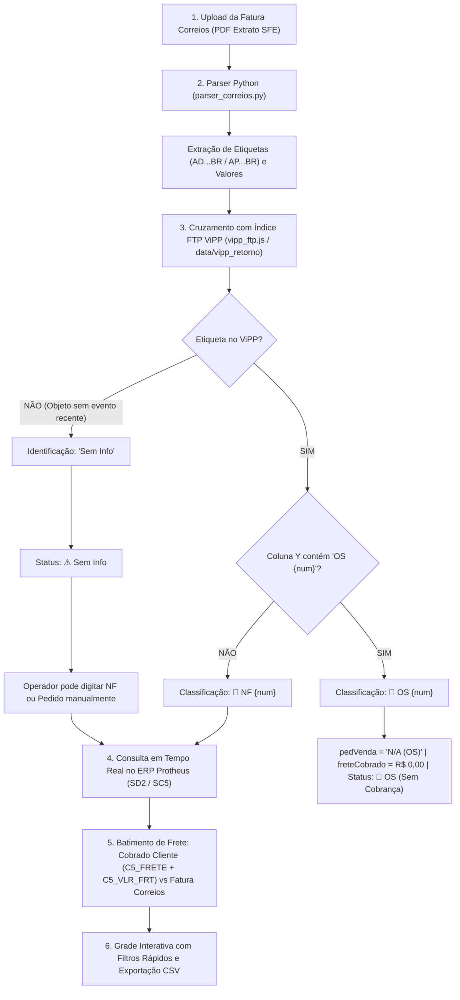

# 📌 Documento de Checkpoint: Aba 2 (Fatura Correios & Integração FTP ViPP)

> **Projeto:** Portal de Conciliação de Fretes & ERP Protheus Multi-Empresas  
> **Módulo:** 2ª Aba — Fatura Correios SFE & Automação de Retorno ViPP VisualSet  
> **Data do Registro:** 21 de Agosto de 2026  
> **Status:** 🟢 **INTEGRAÇÃO CONCLUÍDA E HOMOLOGADA (100% OPERACIONAL)**  
> **Nota Arquival:** Este documento registra o checkpoint técnico histórico desta funcionalidade. Para a visão consolidada e ativa do sistema, consulte [`DOCUMENTO_GESTAO_PROJETO.md`](file:///C:/Users/Alexandre/Documents/Gemini-Cli/DOCUMENTO_GESTAO_PROJETO.md) e [`GEMINI.md`](file:///C:/Users/Alexandre/Documents/Gemini-Cli/GEMINI.md).  

---

## 1. 🎯 Fluxo Operacional e Arquitetura Consolidada

O fluxo de conciliação da **Aba 2 (Correios & ViPP)** opera de forma automatizada e com fallback para edição manual:

---

## 2. 🔐 Dados de Acesso ao Servidor FTP ViPP (Homologados)

| Parâmetro | Configuração Oficial |
| :--- | :--- |
| **Endereço FTP (Host)** | `ftp://vipp.visualset.com.br/` (Porta 21) |
| **Serviço FTP** | Pure-FTPd (com suporte a TLS) |
| **Login / Usuário** | `vipp_003070` |
| **Senha** | `123456vs` |
| **Modo de Transferência** | Modo Passivo (`PASV = True`) |
| **Pasta de Retorno** | `/Retorno` |
| **Padrão de Arquivos** | `Relatorio_Agendado_Vipp{DDMMYYYY}_0001.CSV` |
| **Status da Conexão** | ✅ **100% Testado e Operacional** |

---

## 3. 📊 Mapeamento do Layout CSV ViPP

- **Coluna K (Índice 10):** Número da Etiqueta Correios (`AD...BR`, `AP...BR`).
- **Coluna Y (Índice 24):** Observação / Identificador da postagem:
  - Contém `OS 1234` ➔ Classificada como **Ordem de Serviço (OS)**.
  - Não contém `OS` ➔ Classificada como **Nota Fiscal (NF)**.
- **Coluna V (Índice 21):** Documento fiscal / Número da NF.
- **Coluna Z (Índice 25):** Chave de Acesso da NFe (44 dígitos).
- **Coluna 52 (Coluna BA):** Destinatário (Razão Social / Nome do Cliente).
- **Coluna 53 (Coluna BB):** Observação livre / Dados complementares.

---

## 4. ⚙️ Entregas e Componentes Construídos

1. **Sincronizador FTP e Parser CSV ([`vipp_ftp_sync.py`](file:///C:/Users/Alexandre/Documents/Gemini-Cli/vipp_ftp_sync.py)):**
   - Download incremental dos arquivos em `/Retorno` com cache local em `data/vipp_retorno/`.
   - Detecção inteligente de OS vs. NF com suporte expandido para `OS 1234`, `ORDEM DE SERVIÇO 1234` e `ORDEM DE SERVICO 1234`.
   - Parsing resiliente de CSVs mesmo sem linhas de cabeçalho inicial (avaliação por regex postal em todas as linhas).
2. **Módulo de Integração Backend ([`vipp_ftp.js`](file:///C:/Users/Alexandre/Documents/Gemini-Cli/vipp_ftp.js)):**
   - Cache em memória O(1) indexado por etiqueta postal.
   - Suporte multiplataforma para execução do Python (`python3` no Linux/Docker/Render e `python` no Windows).
   - **Auto-Sync Transparente no Upload:** Conecta e atualiza automaticamente os relatórios do FTP no momento em que o operador envia o PDF (sem obrigação de clique manual).
   - Enriquecimento automático de itens de fatura com regras de OS, NF e Sem Info.
   - Endpoints `/api/vipp/sync-ftp`, `/api/vipp/ftp-status` e `/api/vipp/postagens`.
3. **Validação Estrita de Formatos e Abas ([`server.js`](file:///C:/Users/Alexandre/Documents/Gemini-Cli/server.js), [`parser_rodonaves.py`](file:///C:/Users/Alexandre/Documents/Gemini-Cli/parser_rodonaves.py), [`parser_correios.py`](file:///C:/Users/Alexandre/Documents/Gemini-Cli/parser_correios.py)):**
   - **Aba 1 (Rodonaves):** Rejeita qualquer fatura dos Correios ou layout incompatível com HTTP 400 (*"Esta tela é específica para faturas da transportadora Rodonaves"*).
   - **Aba 2 (Correios & ViPP):** Rejeita faturas da Rodonaves com HTTP 400 (*"Esta aba só serve para faturas dos Correios"*).
   - Eliminação de fallbacks mockados em [`parser_tipo2.py`](file:///C:/Users/Alexandre/Documents/Gemini-Cli/parser_tipo2.py).
4. **Consulta Dinâmica ERP Protheus ([`protheus_db.js`](file:///C:/Users/Alexandre/Documents/Gemini-Cli/protheus_db.js)):**
   - Suporte a busca reversa tanto por número de NF quanto por número de Pedido de Venda (`C5_NUM` / `D2_PEDIDO`).
5. **Interface do Usuário ([`public/index.html`](file:///C:/Users/Alexandre/Documents/Gemini-Cli/public/index.html) e [`public/app.js`](file:///C:/Users/Alexandre/Documents/Gemini-Cli/public/app.js)):**
   - Barra de status de conexão e sincronização FTP em tempo real.
   - Suporte visual completo ao estado `Sem Info` com campo editável para inserção manual de NF ou Pedido.
   - Badges para **OS** (`🔧 OS (Sem Cobrança)`) e filtros dedicados por status.
   - Remoção de componentes legados (botão de exemplo).
6. **Suíte de Testes Automatizados ([`test_vipp_ftp.js`](file:///C:/Users/Alexandre/Documents/Gemini-Cli/test_vipp_ftp.js) e [`test_e2e.js`](file:///C:/Users/Alexandre/Documents/Gemini-Cli/test_e2e.js)):**
   - 52 testes automatizados cobrindo segurança, webhooks bancários, auto-sync FTP ViPP, regras OS/NF/Sem Info, queries Protheus e validações cruzadas de upload HTTP.

---

## 5. 📋 Resumo das Decisões Arquiteturais e Regras Operacionais

- **Auto-Sync sob Demanda:** O operador do dia a dia não precisa clicar manualmente no botão "Sincronizar FTP ViPP". O próprio envio do PDF dispara a checagem incremental se o cache tiver mais de 1 minuto.
- **Isolamento de Abas:** Cada aba possui um contrato estrito de dados e rejeita proativamente PDFs de outras transportadoras para evitar poluição da base ou divergências falsas.
- **Versionamento & Cache-Busting Obrigatório:** Todo ciclo deve rodar `node bump_version.js` antes do commit para garantir atualização de timestamp e parâmetro `?v=X.Y`.

