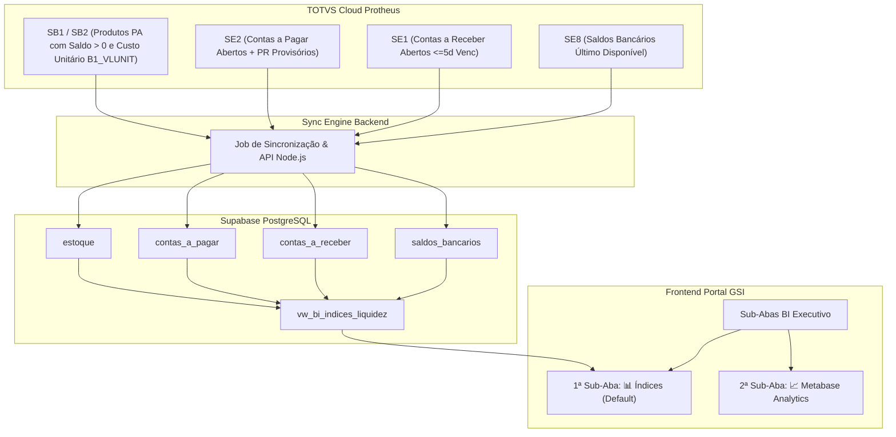

# Plano de Implementação: Módulo de Índices Financeiros de Liquidez (BI Executivo)

## 1. Visão Geral e Objetivos do Módulo

O objetivo deste projeto é expandir a aba **📊 BI EXECUTIVO** do portal com uma nova arquitetura de sub-abas, estabelecendo como visão padrão inicial a sub-aba **📊 Índices Financeiros**, enquanto o painel do Metabase se torna a segunda sub-aba (**📈 Metabase Analytics**).

Para otimizar o desempenho, evitar lentidão e não consumir banda desnecessária do ERP Protheus (TOTVS Cloud), os dados financeiros e de estoque das **3 empresas** (Metal Pleno 14, GSI Cofres 15 e OAÇO 16) serão extraídos e persistidos em tabelas relacionais dedicadas no **Supabase (PostgreSQL)** com suporte a fallback de cache JSON em disco.



---

## 2. Fórmulas e Regras de Negócio dos 3 Índices

### 2.1. Liquidez Corrente ($LC$)
Mede a capacidade geral da empresa de quitar suas obrigações de curto prazo utilizando todos os seus recursos circulantes.

$$LC = \frac{\text{Ativo Circulante}}{\text{Passivo Circulante}}$$

* **Ativo Circulante ($AC$):**
  $$AC = \text{Estoques (Custo Total)} + \text{Saldos Bancários} + \text{Contas a Receber Válidas}$$
  - **Estoques:** $\sum (\text{Quantidade PA com saldo } > 0 \times \text{B1\_VLUNIT})$
  - **Saldos Bancários:** $\sum \text{Último saldo disponível de todas as contas em SE8}$ (garantindo que contas sem movimentação na data corrente tragam o último fechamento real gravado).
  - **Contas a Receber Válidas:** $\sum \text{Títulos abertos em SE1 com saldo } > \text{R\$\ 0,01 e vencimento não ultrapassando 5 dias de atraso}$ ($\text{vencimento} \ge \text{Hoje} - 5\text{ dias}$).
* **Passivo Circulante ($PC$):**
  $$PC = \sum \text{Títulos com saldo pendente } > \text{R\$\ 0,01 em SE2 (incluindo provisórios PR, saldo de baixa parcial; e excluindo adiantamentos PA)}$$

---

### 2.2. Liquidez Seca ($LS$)
Avalia a capacidade de solvência imediata da empresa sem depender da venda de estoques (ativo menos líquido).

$$LS = \frac{\text{Ativo Circulante} - \text{Estoques}}{\text{Passivo Circulante}} = \frac{\text{Saldos Bancários} + \text{Contas a Receber Válidas}}{\text{Passivo Circulante}}$$

---

### 2.3. Liquidez Imediata ($LI$)
Indicador conservador que confronta apenas as disponibilidades imediatas em caixa e bancos contra o passivo circulante.

$$LI = \frac{\text{Disponibilidades}}{\text{Passivo Circulante}} = \frac{\text{Saldos Bancários}}{\text{Passivo Circulante}}$$

---

## 3. Revisão do Usuário & Destaques de Arquitetura

> [!IMPORTANT]
> **1. Multi-Empresa Nativo e Filtro Seletor:**
> Os índices serão calculados tanto de forma **Consolidada (soma das 3 empresas: Metal Pleno 14, GSI 15 e OAÇO 16)** quanto **individualizada por empresa** através de um seletor visual na interface (`Consolidado`, `MP (14)`, `GSI (15)`, `OAÇO (16)`).
>
> **2. Preservação de Campos para Views Futuras:**
> As tabelas persistidas no Supabase incluirão campos estratégicos requeridos pelo usuário, tais como `natureza_cod` (código da natureza financeira Protheus) em contas a receber e contas a pagar, permitindo novas views de DRE, fluxo de caixa e categorização de despesas no Metabase.
>
> **3. Resiliência e Fallback Offline:**
> Assim como no módulo de Saldos em Estoque e Faturamento, caso ocorra qualquer oscilação temporária na conexão TCP com o Supabase, o sistema utiliza automaticamente fallback gracioso em cache JSON local (`data/bi_indices_cache.json`).

---

## 4. Alterações Propostas por Componente

```
┌────────────────────────────────────────────────────────────────────────┐
│                        ESTRUTURA DE ARQUIVOS                           │
├────────────────────────────────────────────────────────────────────────┤
│  sql/bi/                                                               │
│   └── 06_tabelas_indices_liquidez.sql       [NOVO] DDLs & Views        │
│                                                                        │
│  postgres_db.js                             [MODIFICAR] Tabelas & DMLs │
│  protheus_db.js                             [MODIFICAR] Queries ERP    │
│  server.js                                  [MODIFICAR] Rotas /api/bi  │
│                                                                        │
│  public/                                                               │
│   ├── index.html                            [MODIFICAR] Sub-abas BI    │
│   ├── style.css                             [MODIFICAR] Cards & KPIs   │
│   ├── app.js                                [MODIFICAR] Roteamento     │
│   └── js/bi.js                              [MODIFICAR] Renderização   │
│                                                                        │
│  test_bi_indices.js                         [NOVO] Suíte de Testes     │
└────────────────────────────────────────────────────────────────────────┘
```

---

### Componente 1: Banco de Dados Supabase (PostgreSQL)

#### `[NOVO]` `sql/bi/06_tabelas_indices_liquidez.sql` & `[MODIFICAR]` `postgres_db.js`

Criação das 4 tabelas relacionais estruturadas com índices B-Tree, constraints únicas determinísticas e Row-Level Security (RLS) habilitado:

1. **`estoque`:**
   ```sql
   CREATE TABLE IF NOT EXISTS estoque (
     id BIGSERIAL PRIMARY KEY,
     empresa_cod VARCHAR(10) NOT NULL,
     empresa_sigla VARCHAR(10) NOT NULL,
     codigo VARCHAR(50) NOT NULL,
     descricao VARCHAR(255) NOT NULL,
     tipo VARCHAR(10) DEFAULT 'PA',
     grupo_cod VARCHAR(10) DEFAULT '',
     quantidade NUMERIC(15, 4) NOT NULL DEFAULT 0,
     custo_unitario NUMERIC(15, 4) NOT NULL DEFAULT 0,
     preco_venda NUMERIC(15, 2) NOT NULL DEFAULT 0,
     custo_total NUMERIC(15, 2) NOT NULL DEFAULT 0,
     valor_total_venda NUMERIC(15, 2) NOT NULL DEFAULT 0,
     synced_at TIMESTAMP WITH TIME ZONE DEFAULT NOW(),
     CONSTRAINT uq_estoque_empresa_cod UNIQUE (empresa_cod, codigo)
   );
   CREATE INDEX IF NOT EXISTS idx_estoque_empresa ON estoque(empresa_cod);
   CREATE INDEX IF NOT EXISTS idx_estoque_tipo ON estoque(tipo);
   CREATE INDEX IF NOT EXISTS idx_estoque_qtd ON estoque(quantidade);
   ```

2. **`contas_a_receber`:**
   ```sql
   CREATE TABLE IF NOT EXISTS contas_a_receber (
     id BIGSERIAL PRIMARY KEY,
     empresa_cod VARCHAR(10) NOT NULL,
     empresa_sigla VARCHAR(10) NOT NULL,
     filial VARCHAR(10) DEFAULT '01',
     prefixo VARCHAR(10) DEFAULT '',
     numero_titulo VARCHAR(20) NOT NULL,
     parcela VARCHAR(10) DEFAULT '',
     tipo VARCHAR(10) DEFAULT 'NF',
     cliente_cod VARCHAR(20),
     cliente_loja VARCHAR(10),
     cliente_nome VARCHAR(200),
     natureza_cod VARCHAR(20),
     data_emissao DATE,
     data_vencimento DATE NOT NULL,
     data_vencimento_real DATE,
     valor_original NUMERIC(15, 2) NOT NULL DEFAULT 0,
     saldo NUMERIC(15, 2) NOT NULL DEFAULT 0,
     dias_vencido INTEGER DEFAULT 0,
     valido_indice BOOLEAN DEFAULT TRUE,
     status VARCHAR(20) DEFAULT 'ABERTO',
     synced_at TIMESTAMP WITH TIME ZONE DEFAULT NOW(),
     CONSTRAINT uq_contas_a_receber UNIQUE (empresa_cod, prefixo, numero_titulo, parcela, tipo)
   );
   CREATE INDEX IF NOT EXISTS idx_cr_empresa ON contas_a_receber(empresa_cod);
   CREATE INDEX IF NOT EXISTS idx_cr_vencto ON contas_a_receber(data_vencimento);
   CREATE INDEX IF NOT EXISTS idx_cr_natureza ON contas_a_receber(natureza_cod);
   CREATE INDEX IF NOT EXISTS idx_cr_saldo ON contas_a_receber(saldo);
   ```

3. **`contas_a_pagar`:**
   ```sql
   CREATE TABLE IF NOT EXISTS contas_a_pagar (
     id BIGSERIAL PRIMARY KEY,
     empresa_cod VARCHAR(10) NOT NULL,
     empresa_sigla VARCHAR(10) NOT NULL,
     filial VARCHAR(10) DEFAULT '01',
     prefixo VARCHAR(10) DEFAULT '',
     numero_titulo VARCHAR(20) NOT NULL,
     parcela VARCHAR(10) DEFAULT '',
     tipo VARCHAR(10) DEFAULT 'NF',
     fornecedor_cod VARCHAR(20),
     fornecedor_loja VARCHAR(10),
     fornecedor_nome VARCHAR(200),
     natureza_cod VARCHAR(20),
     data_emissao DATE,
     data_vencimento DATE NOT NULL,
     data_vencimento_real DATE,
     valor_original NUMERIC(15, 2) NOT NULL DEFAULT 0,
     saldo NUMERIC(15, 2) NOT NULL DEFAULT 0,
     is_provisorio BOOLEAN DEFAULT FALSE,
     status VARCHAR(20) DEFAULT 'ABERTO',
     synced_at TIMESTAMP WITH TIME ZONE DEFAULT NOW(),
     CONSTRAINT uq_contas_a_pagar UNIQUE (empresa_cod, prefixo, numero_titulo, parcela, tipo)
   );
   CREATE INDEX IF NOT EXISTS idx_cp_empresa ON contas_a_pagar(empresa_cod);
   CREATE INDEX IF NOT EXISTS idx_cp_vencto ON contas_a_pagar(data_vencimento);
   CREATE INDEX IF NOT EXISTS idx_cp_natureza ON contas_a_pagar(natureza_cod);
   CREATE INDEX IF NOT EXISTS idx_cp_tipo ON contas_a_pagar(tipo);
   CREATE INDEX IF NOT EXISTS idx_cp_saldo ON contas_a_pagar(saldo);
   ```

4. **`saldos_bancarios`:**
   ```sql
   CREATE TABLE IF NOT EXISTS saldos_bancarios (
     id BIGSERIAL PRIMARY KEY,
     empresa_cod VARCHAR(10) NOT NULL,
     empresa_sigla VARCHAR(10) NOT NULL,
     banco_cod VARCHAR(10) NOT NULL,
     agencia VARCHAR(10) DEFAULT '',
     conta VARCHAR(20) NOT NULL,
     data_saldo DATE NOT NULL,
     saldo_atual NUMERIC(15, 2) NOT NULL DEFAULT 0,
     synced_at TIMESTAMP WITH TIME ZONE DEFAULT NOW(),
     CONSTRAINT uq_saldos_bancarios UNIQUE (empresa_cod, banco_cod, agencia, conta)
   );
   CREATE INDEX IF NOT EXISTS idx_sb_empresa ON saldos_bancarios(empresa_cod);
   ```

5. **`indices_sync_logs`:**
   Tabela de auditoria para registrar duração em ms, registros sincronizados por tabela e operador responsável.

---

### Componente 2: Extração Protheus & Motor de Cálculo

#### `[MODIFICAR]` `protheus_db.js`

Implementação da função `sincronizarIndicesFinanceirosProtheus({ triggeredBy })`:
1. **Extração de Saldos Bancários (SE8):** Utiliza CTE particionada `ROW_NUMBER() OVER (PARTITION BY E8_BANCO, E8_AGENCIA, E8_CONTA ORDER BY E8_DTSALAT DESC)` para extrair o último saldo registrado de cada conta corrente ativa nas 3 empresas.
2. **Extração de Contas a Receber (SE1):** Leitura de `SE1140`, `SE1150` e `SE1160` onde `E1_SALDO > 0`. Flag `valido_indice = (data_vencimento >= Hoje - 5 dias)`.
3. **Extração de Contas a Pagar (SE2):** Leitura de `SE2140`, `SE2150` e `SE2160` onde `E2_SALDO > 0` (incluindo provisórios `E2_TIPO = 'PR'`).
4. **Extração de Estoques PA (SB2 + SB1):** Leitura de `SB2140`, `SB2150` e `SB2160` cruzando com catálogos `SB1090`, `SB1160`, `SB1100`, calculando `custo_total = quantidade * custo_unitario (B1_VLUNIT)`.

#### `[MODIFICAR]` `server.js`

Criação dos endpoints REST:
- `GET /api/bi/indices`: Retorna o consolidado e os índices individuais por empresa, componentes detalhados e timestamp.
- `POST /api/bi/sync-indices`: Dispara sincronização com trava anti-throttling (cooldown de 2 min) e permissão `admin`.
- `GET /api/bi/indices/contas-a-receber`: Consulta paginada de títulos a receber.
- `GET /api/bi/indices/contas-a-pagar`: Consulta paginada de títulos a pagar.

---

### Componente 3: Frontend & Sub-Abas do BI Executivo

#### `[MODIFICAR]` `public/index.html`

1. **Sub-Abas no Topo de BI Executivo (`#subGroupBi`):**
   ```html
   <div class="sub-tabs-group hidden" id="subGroupBi">
     <button class="nav-tab-btn active" data-tab="tab-bi-indices" id="btnTabBiIndices">
       <svg width="16" height="16" viewBox="0 0 24 24" fill="none" stroke="currentColor" stroke-width="2"><path d="M12 2v20M17 5H9.5a3.5 3.5 0 0 0 0 7h5a3.5 3.5 0 0 1 0 7H6"/></svg>
       <span>📊 Índices Financeiros</span>
     </button>
     <button class="nav-tab-btn" data-tab="tab-bi-metabase" id="btnTabBiMetabase">
       <svg width="16" height="16" viewBox="0 0 24 24" fill="none" stroke="currentColor" stroke-width="2"><rect x="3" y="3" width="18" height="18" rx="2"/><path d="M3 9h18M9 21V9"/></svg>
       <span>📈 Metabase Analytics</span>
     </button>
   </div>
   ```

2. **Estrutura da Sub-Aba 1 (`#tab-bi-indices`):**
   - **Barra Superior:** Filtro seletor de empresa (`Consolidado`, `14 - Metal Pleno`, `15 - GSI`, `16 - OAÇO`), badge de última sincronização e botão `🔄 Sincronizar Protheus`.
   - **Grid de 3 Cards Principais de Índices:**
     - **Card 1: 💧 Liquidez Corrente** (Valor do índice, fórmula explicativa, Badge Verde/Amarelo/Vermelho, Ativo Circulante vs Passivo Circulante).
     - **Card 2: 🧪 Liquidez Seca** (Valor do índice, fórmula explicativa, Ativo Circulante s/ Estoque vs Passivo Circulante).
     - **Card 3: ⚡ Liquidez Imediata** (Valor do índice, fórmula explicativa, Disponibilidades vs Passivo Circulante).
   - **Grid de 4 Cards de Composição (Ativo & Passivo):**
     - 📦 **Estoques PA:** R$ Custo Total | R$ Venda Total | Qtd Itens
     - 🏦 **Disponibilidades Bancárias:** R$ Saldo Total | Qtd Contas Ativas
     - 📥 **Contas a Receber:** R$ Válido Índice | R$ Total Aberto | R$ Inadimplente (>5d)
     - 📤 **Contas a Pagar:** R$ Total Aberto | R$ Provisórios (PR) | R$ Títulos Firmes
   - **Tabela Resumo Comparativo por Empresa & Tabela de Saldos Bancários.**

3. **Estrutura da Sub-Aba 2 (`#tab-bi-metabase`):**
   - Container do Iframe Metabase existente (`#biWrapper`), preservando toolbar, fullscreen e refresh.

#### `[MODIFICAR]` `public/app.js` & `public/js/bi.js`

- Atualização de `switchMainTab('bi')` para exibir o grupo `#subGroupBi` e ativar por padrão `tab-bi-indices`.
- Implementação das funções `carregarIndicesFinanceiros(forceSync)` e renderização dos cards com animações e formatação BRL.

---

## 5. Plano de Verificação e Testes

### 5.1. Testes Automatizados (`test_bi_indices.js`)

Criaremos uma nova suíte de testes com asserções rigorosas:
1. **Fórmula Matemática do Ativo Circulante:** Validação de que $AC = \text{Estoque (Custo Total)} + \text{Bancos} + \text{Receber Válido}$.
2. **Filtro de Vencimento de Contas a Receber:** Garantir que títulos com mais de 5 dias de atraso são excluídos do Ativo Circulante para os índices.
3. **Inclusão Estrita de Provisórios (PR):** Garantir que títulos tipo PR de contas a pagar estão somados no Passivo Circulante.
4. **Cálculo de Liquidez Corrente, Seca e Imediata:** Validação das divisões contra zero e arredondamentos.
5. **Autenticação & RBAC:** Validação de endpoints `/api/bi/indices` e `/api/bi/sync-indices` com JWT.
6. **Fallback JSON:** Validação de leitura/escrita em `data/bi_indices_cache.json` em caso de falha do Postgres.

### 5.2. Verificação Manual
1. Acessar o Portal GSI e clicar na aba principal **📊 BI EXECUTIVO**.
2. Verificar que a sub-aba padrão aberta é **📊 Índices Financeiros** com os 3 cards de Liquidez e 4 cards de detalhamento.
3. Alternar entre as empresas no seletor (`Consolidado`, `MP`, `GSI`, `OAÇO`) e verificar atualização instantânea dos índices.
4. Clicar na sub-aba **📈 Metabase Analytics** e verificar carregamento íntegro do dashboard do Metabase.
5. Clicar no botão `🔄 Sincronizar Protheus` e validar feedback de sucesso e atualização de dados.

---

## 6. Status de Conclusão & Entregas Homologadas (v8.94)

* [x] **Sub-abas no BI Executivo:** Sub-aba 1 (`#tab-bi-indices`) como padrão e Sub-aba 2 (`#tab-bi-metabase`) para o Metabase.
* [x] **Cálculo Matemático Auditável:** LC, LS e LI com regras contábeis estritas (Custo `B1_VLUNIT`, SE8 último saldo, SE1 $\le 5$d e SE2 com PR).
* [x] **Banco de Dados & Supabase:** Tabelas `estoque`, `contas_a_receber`, `contas_a_pagar`, `saldos_bancarios`, `indices_sync_logs` e `indices_liquidez_historico` com RLS.
* [x] **Série Temporal & Snapshots Históricos:** Gravação de 4 snapshots cronológicos por ciclo (Consolidado, 14, 15, 16) para gráficos de tendência no Metabase e portal.
* [x] **Job em Background:** Execução periódica a cada 180 min (07h às 19h de seg a sex) e no startup.
* [x] **Modal Drilldown:** 5 guias internas com extrato matemático detalhado e busca instantânea.
* [x] **Testes Automatizados:** Suíte `test_bi_indices.js` com 17 asserções 100% aprovadas.

