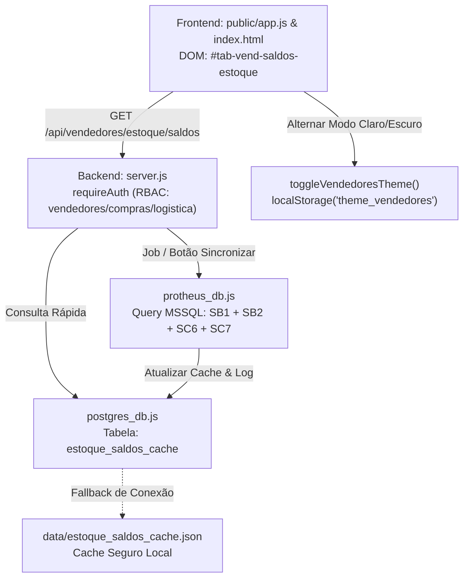
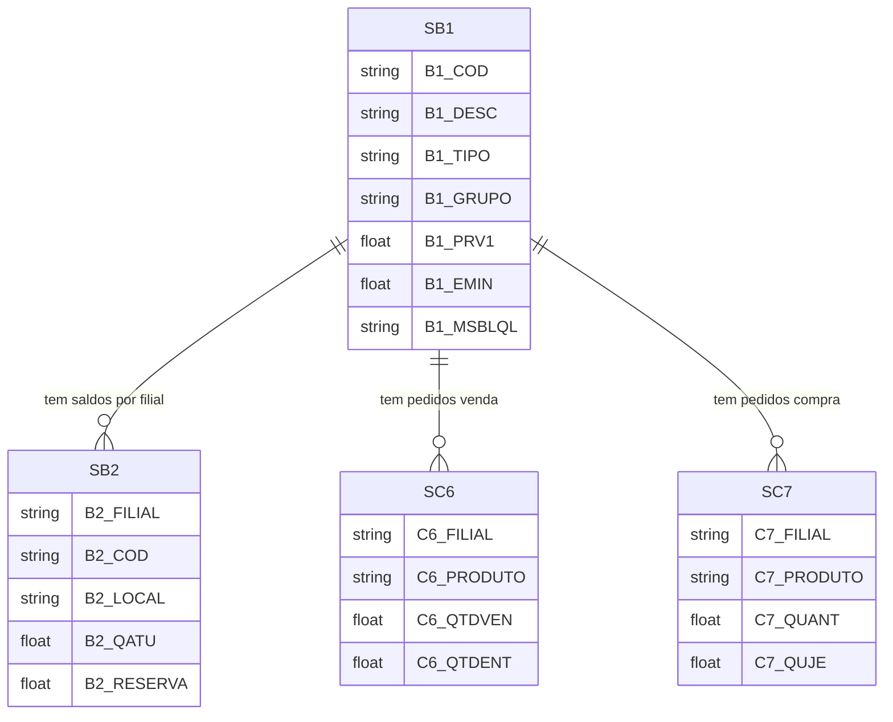

# Saldos em Estoque — Vendedores, Compras & Logística

> **Documentação Técnica Modular — Portal GSI**  
> Módulo de Consulta de Saldos Físicos e Financeiros de Produtos Acabados (PA), Cache de Alta Resiliência, Exportação Excel e Modo Claro/Escuro.

---

## 📋 Identificação da Tela

| Atributo | Especificação |
| :--- | :--- |
| **Macro-Área / Pasta** | `docs/telas/04_vendedores/` (Vendedores & Representantes Comerciais) |
| **Nome da Tela** | Saldos em Estoque Multiempresa (PA) & Cruzamento Comercial |
| **Tab ID DOM** | `#tab-vend-saldos-estoque` |
| **Botões de Acesso DOM** | `#btnTabVendSaldosEstoque` (Vendedores), `#btnTabLogSaldosEstoque` (Logística), `#btnTabComprasSaldosEstoque` (Compras) |
| **Permissão RBAC** | `vendedores`, `compras`, `logistica`, `admin` |
| **Versão / Data** | v3.2 — Setembro/2026 |
| **Status Operacional** | 🟢 Produção com Cache Supabase e Fallback Local |

---

## 1. Propósito da Tela & Personas

### 1.1 Objetivo de Negócio
A tela de **Saldos em Estoque** é a principal interface de consulta operacional de produtos acabados para a força de vendas, equipe de suprimentos e expedição. Em um cenário com três empresas industriais e distribuidoras (14-Metal Pleno, 15-GSI Brasil e 16-OACO), consultar estoques diretamente no ERP Protheus via query pesada gerava:
- Lentidão extrema (10 a 15 segundos por consulta em horários de pico).
- Travamentos decorrentes de concorrência com o faturamento do Protheus.
- Inclusão indevida de itens de engenharia descontinuados (`XXX`), matérias-primas e protótipos bloqueados (`MSBLQL = 1`).

A tela resolve isso ao implementar:
1. **Cache Supabase / PostgreSQL de Alta Performance:** Tempo de resposta inferior a 80 ms, com fallback para arquivo JSON local.
2. **Visão Consolidada Multiempresa:** Saldo físico separado por filial (`14`, `15`, `16`) somado ao saldo total.
3. **Cruzamento com Carteira e Reposição:** Exibição imediata de pedidos de venda já colocados (`SC6`), pedidos de compras em trânsito (`SC7`) e Ponto de Pedido Ideal (`B1_EMIN`).
4. **Acessibilidade e Ergonomia:** Suporte completo à alternância entre Tema Claro e Tema Escuro em conformidade com as diretrizes WCAG 2.1 AA.
5. **Exportação Integral para Excel:** Download de todas as páginas filtradas em formato CSV delimitado por ponto e vírgula com BOM UTF-8.

### 1.2 Personas Envolvidas
- **Vendedor Interno / Externo / Representante:** Consulta rápida de pronta-entrega para responder cotações de clientes instantaneamente.
- **Comprador / Gestor de Suprimentos:** Análise do saldo atual versus ponto de pedido para emissão de ordens de compra de reposição.
- **Líder de Expedição / Logística:** Identificação de em qual filial o produto está fisicamente localizado para montagem de carga.
- **Gerente Comercial:** Acompanhamento do valor total do estoque imobilizado e giro dos principais grupos de produtos.

### 1.3 Fluxo Operacional Típico
1. O usuário acessa a aba pelo módulo de **Vendedores**, **Compras** ou **Logística**.
2. A tela carrega instantaneamente os dados do cache consolidado com paginação de 50 itens por página.
3. Os cards de KPI exibem: **Itens com Estoque**, **Itens sem Estoque** e **Valor Total do Estoque (R$)**.
4. O usuário pode filtrar por:
   - **Disponibilidade:** Todos, Saldo Positivo ou Zerado/Negativo.
   - **Grupo de Produto:** Armários Corta-Fogo (`018`), Cofres Digitais (`001`), Mecânicos (`002`), etc.
   - **Filial Específica:** Apenas itens com estoque em `14 - MP`, `15 - GSI` ou `16 - OACO`.
   - **Busca Textual:** Código de produto ou descrição (ex: `CORTA FOGO 200X100`).
5. Ao clicar em um produto, abre-se o modal de drilldown com o detalhamento por depósito e pedidos em aberto.
6. Clicando em **"Exportar Excel"**, o sistema faz o download de todos os registros correspondentes aos filtros aplicados.

---

## 2. Arquitetura de Código & Componentes



### 2.1 Estrutura Frontend
- **Arquivo de Script:** [`public/app.js`](file:///C:/Users/Alexandre/Documents/Gemini-Cli/public/app.js) (funções `carregarSaldosEstoque`, `renderTabelaEstoque`, `exportarEstoqueExcel`, `toggleVendedoresTheme`, `aplicarTemaVendedores`).
- **Container DOM:** `#tab-vend-saldos-estoque` em [`public/index.html`](file:///C:/Users/Alexandre/Documents/Gemini-Cli/public/index.html).
- **Componentes Visuais Chave:**
  - Cards de KPIs:
    - `#kpiItensEstoque`: Contagem de SKUs ativos com saldo $> 0$.
    - `#kpiItensSemEstoque`: Contagem de SKUs ativos zerados.
    - `#kpiValorEstoque`: Montante financeiro total do estoque disponível ($\sum \text{Saldo} \times \text{Preço Unitário}$).
  - Filtros:
    - `#filtroEstoque`: Alternância entre `todos`, `positivo`, `zerado_negativo`.
    - `#filtroGrupoEstoque`: Grupos comerciais autorizados (`TODOS`, `001`, `002`, `010`, `018`).
    - `#filtroEmpresaEstoque`: Isolamento por filial (`TODAS`, `14`, `15`, `16`).
    - `#searchEstoque`: Campo de busca rápida com debounce de digitação.
  - Botões de Ação:
    - `#btnExportarEstoqueExcel`: Exportação completa para CSV/Excel.
    - `#btnSincronizarEstoque`: Disparo manual de sincronização com o Protheus.
    - `#btnToggleThemeEstoque` e `#btnToggleThemeVendedores`: Botão de alternância de Tema Claro / Escuro com persistência.
  - Grid e Paginação: `#tabelaEstoque` e container `#estoquePaginationContainer`.
  - Modal Drilldown: `#modalEstoqueDetalhes` para abertura de histórico de movimentação por filial.

### 2.2 Estrutura Backend & Serviços
- **Servidor HTTP:** Endpoints em [`server.js`](file:///C:/Users/Alexandre/Documents/Gemini-Cli/server.js).
- **Camada de Dados Postgres:** [`postgres_db.js`](file:///C:/Users/Alexandre/Documents/Gemini-Cli/postgres_db.js) com as funções `getSaldosEstoqueDB`, `saveSaldosEstoqueDB` e `getUltimoSyncEstoqueLog`.
- **Extrator Protheus:** [`protheus_db.js`](file:///C:/Users/Alexandre/Documents/Gemini-Cli/protheus_db.js).
- **Armazenamento de Resiliência:** [`safe_json_storage.js`](file:///C:/Users/Alexandre/Documents/Gemini-Cli/safe_json_storage.js) garantindo gravação atômica em disco para evitar corrupção em falhas elétricas.

---

## 3. Banco de Dados & Modelagem

### 3.1 Protheus ERP (MSSQL)
O motor de sincronização consulta as seguintes tabelas do Protheus:



- **SB1010 (Produtos):**
  - `B1_COD`: Código interno do produto.
  - `B1_DESC`: Descrição comercial oficial.
  - `B1_TIPO`: Tipo do produto (filtrado estritamente para `PA`).
  - `B1_GRUPO`: Código do grupo de produto.
  - `B1_PRV1`: Preço unitário da Tabela 1.
  - `B1_EMIN`: Ponto de pedido configurado pela engenharia.
  - `B1_MSBLQL`: Flag de bloqueio (`1` = Bloqueado/Inativo, `2` = Ativo).
- **SB2010 (Saldos em Estoque):** `B2_FILIAL` (`14`, `15`, `16`), `B2_LOCAL` (Almoxarifados comerciais válidos) e `B2_QATU` (Quantidade física atual).
- **SC6010 (Pedidos de Venda em Aberto):** Saldo a faturar $= \text{C6\_QTDVEN} - \text{C6\_QTDENT}$.
- **SC7010 (Pedidos de Compra em Aberto):** Saldo a receber $= \text{C7\_QUANT} - \text{C7\_QUJE}$.

### 3.2 PostgreSQL / Supabase

#### Tabela `estoque_saldos_cache`
Armazena a visão desnormalizada e indexada:
- `codigo`: VARCHAR(30) (Primary Key).
- `descricao`: VARCHAR(255).
- `grupo`: VARCHAR(10).
- `preco`: NUMERIC(15,2).
- `saldo`: NUMERIC(15,2) (Soma consolidada física).
- `saldo_total`: NUMERIC(15,2) ($\text{Saldo} \times \text{Preço}$).
- `qtd_vendas`: NUMERIC(15,2) (Pedidos SC6 em carteira).
- `qtd_compras`: NUMERIC(15,2) (Ordens SC7 em reposição).
- `ponto_ped`: NUMERIC(15,2) (Estoque mínimo).
- `detalhes_empresas`: JSONB com a distribuição por filial:
  ```json
  {
    "14": { "saldo": 5, "vendas": 0, "compras": 10 },
    "15": { "saldo": 10, "vendas": 1, "compras": 6 },
    "16": { "saldo": 0, "vendas": 0, "compras": 0 }
  }
  ```

#### Tabela `estoque_sync_logs`
Rastreabilidade e auditoria dos ciclos de sincronização:
- `id`: SERIAL PRIMARY KEY.
- `status`: VARCHAR(20) NOT NULL (`SUCCESS`, `ERROR`).
- `total_produtos`: INTEGER.
- `total_saldo_positivo`: INTEGER.
- `total_valor_estoque`: NUMERIC(15,2).
- `duracao_ms`: INTEGER.
- `triggered_by`: VARCHAR(100) (`CRON_JOB`, `MANUAL (Usuario)`).
- `error_message`: TEXT.
- `synced_at` / `created_at`: TIMESTAMP WITH TIME ZONE DEFAULT NOW().

---

## 4. Regras de Negócio & Cálculos Chave

### 4.1 Filtragem Estrita de Produtos Acabados (PA)
Para garantir que a equipe de vendas visualize apenas produtos comercializáveis legítimos:
```javascript
function isProdutoValido(cod, desc, tipo, grupo, msblql) {
  const cleanCod = String(cod || '').trim().toUpperCase();
  const cleanDesc = String(desc || '').trim().toUpperCase();
  const cleanTipo = String(tipo || '').trim().toUpperCase();
  const cleanGrupo = String(grupo || '').trim();
  const cleanMsblql = String(msblql || '2').trim();

  // 1. Descarta códigos de teste ou descontinuados
  if (cleanDesc.includes('XXX')) return false;
  if (cleanCod.includes('X')) return false;
  if (!cleanCod.includes('0')) return false;

  // 2. Apenas Produto Acabado (PA)
  if (cleanTipo && cleanTipo !== 'PA') return false;

  // 3. Descarta produtos bloqueados no Protheus
  if (cleanMsblql === '1') return false;

  // 4. Grupos comerciais autorizados
  const gruposPermitidos = ['001', '002', '010', '018', '0001', '0002', '0010', '0018'];
  if (cleanGrupo && !gruposPermitidos.includes(cleanGrupo)) return false;

  return true;
}
```

### 4.2 Consolidação de Saldo e Valor Monetário
$$\text{Saldo Total Físico} = \text{Saldo}_{\text{Filial 14}} + \text{Saldo}_{\text{Filial 15}} + \text{Saldo}_{\text{Filial 16}}$$
$$\text{Saldo Total (R\$)} = \text{round}(\text{Saldo Total Físico} \times \text{Preço Unitário}, 2)$$

- Exemplo: 15 unidades de armário corta-fogo a R$ 6.600,00 $= \text{R\$}~99.000,00$.
- Se o produto tiver saldo zerado ou negativo em virtude de ajustes de inventário, seu valor total financeiro é obrigatoriamente $0,00$.

### 4.3 Exportação Completa para Excel (CSV com BOM UTF-8)
Diferente de grids comuns que exportam apenas a página corrente visível, a exportação de estoque do Portal GSI:
1. Exporta **todas as páginas** do resultado filtrado.
2. Inicia com o caractere especial **BOM UTF-8 (`\uFEFF`)**, instruindo o Microsoft Excel no Windows a abrir o arquivo imediatamente com a acentuação correta sem exigir importação de texto.
3. Utiliza o delimitador padrão brasileiro ponto e vírgula (`;`).
4. Formata os valores monetários com vírgula decimal (ex: `"6600,00"`) e envolve textos com aspas duplas sanitizadas contra injeção de fórmulas CSV.

### 4.4 Alternância de Tema Claro / Escuro & Acessibilidade WCAG 2.1 AA
A tela implementa um sistema completo de toggle de tema acionado por `#btnToggleThemeEstoque` e `#btnToggleThemeVendedores`:
- A preferência é gravada no navegador via `localStorage.setItem('theme_vendedores', 'light' | 'dark')`.
- O tema selecionado é propagado automaticamente para todas as 5 sub-abas do módulo de Vendedores e para o módulo de Compras.
- As cores de fontes e badges se ajustam dinamicamente para preservar alto contraste:

| Elemento | Tema Escuro (Padrão) | Tema Claro (`.tab-theme-light`) |
| :--- | :--- | :--- |
| **Fundo dos Cards** | `#1e293b` | `#ffffff` / borda `#e2e8f0` |
| **Texto dos Títulos** | `#f1f5f9` | `#0f172a` (Preto azulado WCAG AAA) |
| **Saldo Positivo** | `#10b981` (Verde Esmeralda Claro) | `#059669` (Verde Escuro WCAG AA) |
| **Compras / Reposição** | `#38bdf8` (Azul Celeste) | `#0284c7` (Azul Cobalto WCAG AA) |
| **Vendas em Carteira** | `#fbbf24` (Âmbar Claro) | `#d97706` (Âmbar Queimado WCAG AA) |
| **Modais Drilldown** | Fundo escuro opaco | `.modal-theme-light` com contraste alto |

---

## 5. Endpoints REST da API

### 5.1 `GET /api/vendedores/estoque/saldos`
- **Descrição:** Retorna a listagem paginada e os KPIs gerais do estoque a partir do cache Supabase.
- **Autenticação:** `Bearer JWT` (Permissões: `vendedores`, `compras`, `logistica` ou `admin`).
- **Query Params:**
  - `filtroEstoque`: `todos` (default), `positivo`, `zerado_negativo`.
  - `filtroGrupo`: Código do grupo (ex: `018`).
  - `filtroEmpresa`: Código da filial (`14`, `15`, `16`).
  - `search`: Termo de busca textual.
  - `page`: Número da página (1-indexed, default `1`).
  - `limit`: Itens por página (default `50`).
- **Exemplo de Resposta (HTTP 200):**
  ```json
  {
    "success": true,
    "kpis": {
      "totalItensEstoque": 84,
      "totalItensSemEstoque": 12,
      "totalValorEstoque": 1250400.50
    },
    "data": [
      {
        "codigo": "001001000000001",
        "descricao": "ARMARIO CORTA FOGO 200X100X45 CM - VERMELHO",
        "grupo": "018",
        "preco": 6600.00,
        "saldo": 15,
        "saldo_total": 99000.00,
        "qtd_vendas": 1,
        "qtd_compras": 16,
        "ponto_ped": 25,
        "detalhes_empresas": {
          "14": { "saldo": 5, "vendas": 0, "compras": 10 },
          "15": { "saldo": 10, "vendas": 1, "compras": 6 },
          "16": { "saldo": 0, "vendas": 0, "compras": 0 }
        }
      }
    ],
    "pagination": { "page": 1, "totalPages": 2, "total": 96 },
    "lastSync": { "synced_at": "2026-09-15T14:30:00.000Z", "status": "SUCCESS" }
  }
  ```

### 5.2 `POST /api/vendedores/estoque/sync`
- **Descrição:** Dispara uma sincronização imediata contra o ERP Protheus MSSQL para atualizar o cache do Supabase e o fallback local.
- **Autenticação:** `Bearer JWT`.

---

## 6. Testes Automatizados Vinculados

| Arquivo de Teste | Quantidade de Testes | Cobertura Validada |
| :--- | :--- | :--- |
| [`test_saldos_estoque.js`](file:///C:/Users/Alexandre/Documents/Gemini-Cli/test_saldos_estoque.js) | 9 Testes | Multiplicação matemática `saldo * preco`, descarte estrito de itens com `XXX` ou `MSBLQL = 1`, gravação/leitura no cache e fallback JSON, integridade de parâmetros SQL em `estoque_sync_logs`, resiliência da data de sincronização, isolamento por filial e exportação CSV com BOM UTF-8. |
| [`test_theme_toggle.js`](file:///C:/Users/Alexandre/Documents/Gemini-Cli/test_theme_toggle.js) | 5 Testes | Presença de seletores HTML de tema, estilos CSS de alto contraste `.tab-theme-light`, funções JS em `app.js`, cores dinâmicas WCAG 2.1 AA e sincronização da classe `.modal-theme-light` nos modais drilldown. |

### Comandos de Execução dos Testes:
```bash
node test_saldos_estoque.js
node test_theme_toggle.js
```

---

## 7. Histórico Recente da Tela

| Versão | Data | Autor | Principais Alterações |
| :--- | :--- | :--- | :--- |
| **v3.2** | 2026-09-13 | Alexandre / Equipe GSI | Implementação do seletor e persistência de Tema Claro/Escuro (`test_theme_toggle.js`) com adequação de contraste WCAG AA. |
| **v3.1** | 2026-09-09 | Alexandre / Equipe GSI | Exportação integral para Excel com inclusão de BOM UTF-8 e sanitização de caracteres acentuados. |
| **v3.0** | 2026-09-03 | Alexandre / Equipe GSI | Migração da camada de consulta para cache relacional no Supabase com fallback atômico em disco (`data/estoque_saldos_cache.json`). |
| **v2.5** | 2026-08-25 | Alexandre / Equipe GSI | Refinamento da regra de descarte de produtos de engenharia (`XXX`) e bloqueados no Protheus (`MSBLQL = 1`). |
