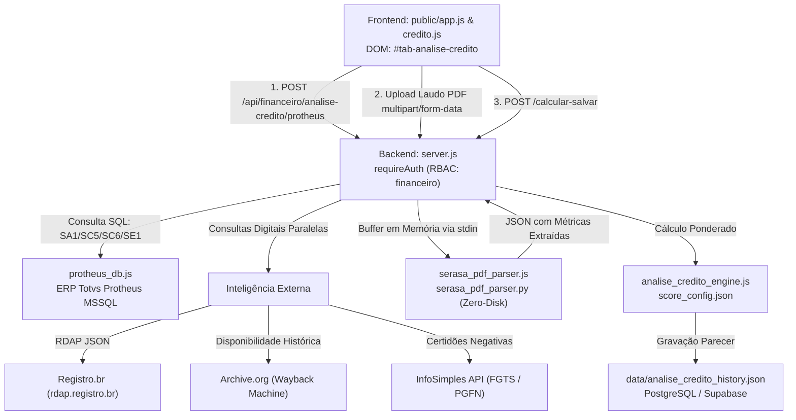
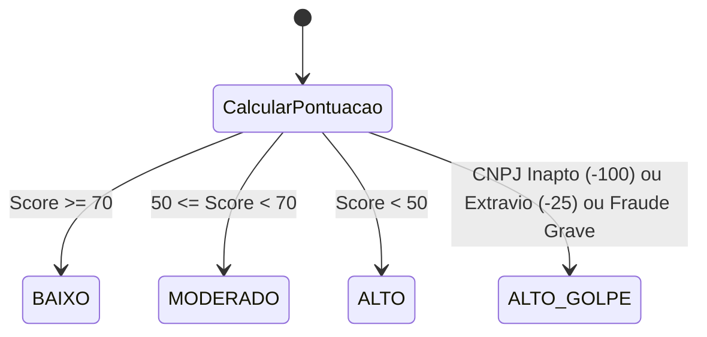

# Análise de Crédito Comercial — Assistente Financeiro & Crédito

> **Documentação Técnica Modular — Portal GSI**  
> Motor de Score de Risco, Leitor Efêmero de Laudos Serasa Experian (Zero-Disk), Inteligência Digital Paralela (RDAP & Wayback) e Certidões Automatizadas (FGTS Caixa & PGFN).

---

## 📋 Identificação da Tela

| Atributo | Especificação |
| :--- | :--- |
| **Macro-Área / Pasta** | `docs/telas/06_assist_financeiro/` (Assistente Financeiro & Crédito) |
| **Nome da Tela** | Análise de Crédito Comercial, Score Anti-Golpe & Validador Serasa |
| **Tab ID DOM** | `#tab-analise-credito` |
| **Botão de Acesso DOM** | `#btnTabAnaliseCredito` |
| **Permissão RBAC** | `financeiro`, `admin` |
| **Versão / Data** | v4.0 — Setembro/2026 |
| **Status Operacional** | 🟢 Produção com Leitura Efêmera em Memória e APIs Paralelas |

---

## 1. Propósito da Tela & Personas

### 1.1 Objetivo de Negócio
A venda faturada a prazo para pessoas jurídicas é uma das atividades comerciais de maior risco financeiro na indústria metalmecânica. O Portal GSI introduziu um motor avançado de **Análise de Crédito e Prevenção a Fraudes Corporativas**, protegendo a empresa contra:
1. **Golpes do "CNPJ Esquecido" / Invasão Societária:** Empresas antigas compradas por estelionatários com alteração repentina de sócios, aumento fictício de capital social e emissão imediata de pedidos de alto valor.
2. **Inadimplência Estrutural:** Clientes com dívidas ativas volumosas inscritas na Procuradoria-Geral da Fazenda Nacional (PGFN) ou restrições severas no Serasa Experian (PEFIN, REFIN, Protestos, Dívidas Vencidas).
3. **Empresas de Fachada ("Fantasmas"):** Clientes que fornecem e-mails gratuitos (`@gmail.com`, `@hotmail.com`), sem domínio corporativo registrado no Registro.br ou com domínios criados há menos de 30 dias e sem qualquer histórico no Wayback Machine (Archive.org).

A tela consolida os dados cadastrais do Protheus, faz consultas simultâneas de inteligência digital em múltiplos provedores externos, processa laudos em PDF do Serasa sem gravá-los em disco e calcula um **Score Numérico de 0 a 100+ pontos** com diagnóstico explícito de risco comercial.

### 1.2 Personas Envolvidas
- **Assistente Financeiro / Analista de Crédito (ex: Beatriz / Érica):** Insere o CNPJ ou número do pedido, sobe o laudo Serasa e analisa os faróis de risco antes de liberar o faturamento.
- **Gerente Financeiro / Controladoria (Rubens / Alexandre):** Avalia pedidos em zona cinzenta (Risco Moderado), analisa as justificativas no histórico e delibera sobre pedidos que excedem limites operacionais.
- **Vendedor / Representante Comercial:** Acompanha o parecer da análise para negociar condições de pagamento alternativas (ex: entrada de 50%, pagamento à vista ou garantia real).

### 1.3 Fluxo Operacional Típico
1. O assistente informa o **CNPJ do Cliente** e, opcionalmente, o **Número do Pedido de Venda** do Protheus.
2. Clica em **"Puxar Dados Protheus"**: o backend dispara em paralelo:
   - Consulta cadastral e financeira no Protheus (`SA1`, `SC5`, `SC6`, `SE1`).
   - Consulta RDAP no Registro.br para verificar se o domínio do e-mail corporativo pertence ao CNPJ do cliente.
   - Consulta ao Wayback Machine para verificar há quantos anos o site corporativo existe na web.
   - Consulta às certidões governamentais (FGTS Caixa e Dívida Ativa PGFN).
3. O operador arrasta o **Laudo Serasa em PDF** para a área de upload. O backend processa o PDF diretamente na memória RAM em menos de 2 segundos.
4. Os campos do formulário são autopreenchidos: Score Serasa, Capital Social, PEFIN, REFIN, Protestos, etc.
5. Os faróis de risco (verde, amarelo, vermelho) indicam a confiabilidade de cada critério.
6. O operador clica em **"Calcular Score & Salvar Parecer"**:
   - O motor computa a pontuação final (0 a 100+).
   - Classifica o risco em **Baixo (Aprovado)**, **Moderado (Exige Garantia)** ou **Alto (Apenas à Vista / Reprovado)**.
   - Registra o histórico auditável de análise no sistema.

---

## 2. Arquitetura de Código & Componentes



### 2.1 Estrutura Frontend
- **Arquivos de Script:** [`public/js/credito.js`](file:///C:/Users/Alexandre/Documents/Gemini-Cli/public/js/credito.js) e [`public/app.js`](file:///C:/Users/Alexandre/Documents/Gemini-Cli/public/app.js).
- **Container DOM:** `#tab-analise-credito` em [`public/index.html`](file:///C:/Users/Alexandre/Documents/Gemini-Cli/public/index.html).
- **Componentes Visuais Chave:**
  - `#formAnaliseCredito`: Formulário parametrizado contendo todos os vetores de risco divididos em grupos operacionais.
  - `#dropZoneSerasaPdf`: Área de drag-and-drop para ingestão do laudo Serasa com barra de progresso visual.
  - `#btnConsultaCaixaFgts`: Botão de consulta assistida em 1-clique para a Caixa Econômica Federal (copia o CNPJ sanitizado para a área de transferência e abre o portal oficial em nova aba).
  - Faróis de Resiliência: Badges coloridos `#badgeStatusRdap`, `#badgeStatusWayback`, `#badgeStatusFgts`, `#badgeStatusPgfn`.
  - `#cardScoreResultado`: Painel de destaque exibindo o Score Final, diagnóstico detalhado (subGolpe, subFinanceiro) e recomendação de crédito.
  - Tabela de Histórico: Listagem das últimas análises realizadas com modal de conferência.

### 2.2 Estrutura Backend & Módulos de Apoio
- **Servidor HTTP:** Rotas sob `/api/financeiro/analise-credito` no [`server.js`](file:///C:/Users/Alexandre/Documents/Gemini-Cli/server.js).
- **Motor de Score:** [`analise_credito_engine.js`](file:///C:/Users/Alexandre/Documents/Gemini-Cli/analise_credito_engine.js) (funções puras `calcularScore`, `getScoreConfig`, `saveScoreConfig`).
- **Parser Serasa Efêmero:** [`serasa_pdf_parser.js`](file:///C:/Users/Alexandre/Documents/Gemini-Cli/serasa_pdf_parser.js) e [`serasa_pdf_parser.py`](file:///C:/Users/Alexandre/Documents/Gemini-Cli/serasa_pdf_parser.py).
- **Configurações Persistidas:** `data/score_config.json` e `data/analise_credito_history.json`.

---

## 3. Banco de Dados & Modelagem

### 3.1 Protheus ERP (MSSQL)
- `SA1010` (Clientes): `A1_COD`, `A1_CGC`, `A1_NOME`, `A1_END`, `A1_EST`, `A1_EMAIL`, `A1_PRICOM` (Data da primeira compra), `A1_ULTCOM` (Última compra), `A1_NROCOM` (Total histórico de compras), `A1_SALDUP` (Saldo atual em aberto de duplicatas).
- `SC5010` / `SC6010` (Pedidos de Venda): `C5_NUM`, `C5_CONDPAG` (Condição à vista vs faturado), `C5_VALBRUT`, `C6_PRODUTO`, contagem de itens distintos e verificação de mix de produtos.
- `SE1010` (Contas a Receber): Checagem de títulos vencidos em aberto (`E1_SALDO > 0 AND E1_VENCTO < HOJE`).

### 3.2 Persistência e Arquivos de Configuração
- **`data/score_config.json`:** Armazena os pesos ponderados de cada parâmetro (com suporte a restauração para os pesos oficiais via botão reset).
- **`data/analise_credito_history.json` / PostgreSQL:**
  - `id`: Identificador único.
  - `data_analise`: Timestamp da realização.
  - `cnpj`: CNPJ formatado do cliente.
  - `razao_social`: Razão social do cliente.
  - `numero_pedido`: Número do pedido no Protheus (se informado).
  - `score_calculado`: Pontuação numérica atingida.
  - `risco_classificacao`: `BAIXO`, `MODERADO`, `ALTO`.
  - `diagnostico`: Resumo textual dos principais fatores penalizadores ou bonificadores.
  - `dados_entrada`: Snapshot completo dos parâmetros fornecidos para fins de auditoria interna.
  - `usuario`: Operador responsável pela análise.

---

## 4. Regras de Negócio & Cálculos Chave

### 4.1 Parser Serasa Experian Efêmero (Zero-Disk Storage)
Para atender às exigências da LGPD e proteger o sigilo financeiro dos clientes:
1. O arquivo PDF é recebido via `multipart/form-data` e mantido estritamente em um `Buffer` na memória RAM do processo Node.js (`multer.memoryStorage()`).
2. O buffer é injetado via `stdin` para o processo filho Python (`serasa_pdf_parser.py -`).
3. O script Python analisa a estrutura textual e tabular do documento via stream, extrai as métricas e devolve o JSON estruturado via `stdout`.
4. **Nenhum arquivo temporário é escrito em disco**.
5. **Validação de Modelo e Validade:**
   - O laudo é rejeitado se não contiver os marcadores estritos do Serasa Experian.
   - **Validade Máxima de 4 Meses:** Laudos emitidos há mais de 120 dias em relação à data da análise são sumariamente rejeitados com erro `LAUDO_EXPIRADO`.
   - Extrai automaticamente: Score Serasa (0 a 1000), Probabilidade de Default (PD %), Dívidas Vencidas, PEFIN, REFIN, Protestos, Cheques sem Fundo, Consultas Recentes, Participação em Fomento Mercantil (Factoring) e Alerta de Documentos Extraviados.

### 4.2 Inteligência Digital Paralela: RDAP & Wayback Machine

#### RDAP Registro.br (`consultarRDAP`)
- Consulta automática do domínio do e-mail comercial informado (ex: `cliente@acosaero.com.br` $\rightarrow$ consulta domínio `acosaero.com.br`).
- **Validação de Raiz de CNPJ:** Compara os primeiros 8 dígitos do CNPJ cadastral do cliente com o documento do detentor do domínio no Registro.br.
  - Se coincidir a raiz (ex: matriz e filial): **`peso_registro_br_sim = +6 pts`**.
  - Se o domínio for registrado por terceiro sem vínculo ou CPF aleatório: **0 pts**.

#### Wayback Machine (`consultarWayback`)
- Consulta na API pública do Archive.org para apurar o primeiro snapshot histórico daquele domínio na internet.
- Se o site já possuía páginas ativas há mais de 5 anos: **`peso_wayback_5 = +3 pts`**.
- Se o domínio foi registrado recentemente e não tem nenhum histórico web: **0 pts** e alerta visual de potencial empresa de fachada.

### 4.3 Certidões Governamentais InfoSimples (FGTS Caixa & Dívida PGFN)
- **FGTS Caixa:**
  - Situação Não Regular: **`peso_fgts_regular_nao = -6 pts`**.
  - Razão Social na Caixa idêntica ao Protheus: **`peso_razao_fgts_igual_sim = +3 pts`**.
  - Razão Social divergente na Caixa: **`peso_razao_fgts_igual_nao = -15 pts`** (alerta gravíssimo de fraude cadastral).
- **Dívida Ativa da União (PGFN):**
  - Certidão Negativa (Dívida R$ 0,00): **`peso_pgfn_zero = +2 pts`**.
  - Dívida Ativa superior a R$ 50.000,00: **`peso_pgfn_gt_50k = -7 pts`**.
  - Dívida Ativa superior ao Capital Social: **`peso_pgfn_gt_capital = -20 pts`** (risco iminente de insolvência).

### 4.4 Novos Critérios Anti-Golpe (Invasão Societária)
Baseado nos casos recentes de fraudes contra distribuidoras industriais:
- **Alteração Recente de Sócios (`alteracao_recente_socios = 'S'`):** **`-8 pts`**. Indica que a empresa mudou seu quadro societário nos últimos meses.
- **Aumento Expressivo de Capital Social (`aumento_expressivo_capital = 'S'`):** **`-20 pts`**. Indica capital aumentado subitamente sem lastro contábil evidente para inflar limites de crédito.

### 4.5 Fórmula Geral de Pontuação do Score
$$\text{Score} = \sum \text{Pontos Comerciais} + \sum \text{Pontos Cadastrais} + \sum \text{Pontos Digitais} + \sum \text{Pontos Serasa/Certidões}$$



- **Faixa Verde ($\ge 70$ pts):** Risco Baixo. Limite liberado para faturamento nos prazos padrão (ex: 28/42 dias).
- **Faixa Amarela ($50$ a $69$ pts):** Risco Moderado. Exige aprovação gerencial, garantia pessoal de sócios ou entrada de 30% a 50%.
- **Faixa Vermelha ($< 50$ pts):** Risco Alto / Reprovado. Venda autorizada estritamente com **pagamento antecipado (à vista)**.

---

## 5. Endpoints REST da API

### 5.1 `POST /api/financeiro/analise-credito/protheus`
- **Descrição:** Extrai dados de faturamento do Protheus e dispara consultas paralelas (RDAP, Wayback, DNS MX, InfoSimples).
- **Request Body:** `{ "cnpj": "09.406.820/0003-14", "numPedido": "123456" }`
- **Resposta Sucesso:** Retorna objeto consolidado com dados cadastrais, histórico de compras e status dos provedores digitais.

### 5.2 `POST /api/financeiro/analise-credito/parse-serasa-pdf`
- **Descrição:** Ingestão de PDF do Serasa via `multipart/form-data` (`serasa_pdf`).
- **Processamento:** Buffer em memória RAM $\rightarrow$ Python stdin $\rightarrow$ JSON. Retorna métricas extraídas sem salvar em disco.

### 5.3 `POST /api/financeiro/analise-credito/calcular-salvar`
- **Descrição:** Recebe os dados consolidados do formulário, executa o motor de cálculo e grava o histórico.
- **Request Body:**
  ```json
  {
    "total_pedido": 15000,
    "faturado": "S",
    "cnpj_ativo": "S",
    "score_serasa": 750,
    "capital_social": 1000000,
    "alteracao_recente_socios": "N",
    "aumento_expressivo_capital": "N",
    "pgfn_total_divida": 0,
    "fgts_situacao_regular": "S"
  }
  ```
- **Resposta Sucesso (HTTP 200):**
  ```json
  {
    "success": true,
    "score": 78,
    "risco": "BAIXO",
    "diagnostico": "Cliente consolidado, sem restrições fiscais ou societárias.",
    "detalhesPontos": { ... }
  }
  ```

### 5.4 `GET /api/financeiro/analise-credito/historico`
- **Descrição:** Retorna a listagem das análises de crédito efetuadas para conferência e auditoria.

### 5.5 `GET /api/financeiro/analise-credito/config` / `POST /api/financeiro/analise-credito/config`
- **Descrição:** Consulta e calibração dinâmica dos pesos matemáticos do score.

---

## 6. Testes Automatizados Vinculados

O motor de análise de crédito e seus componentes contam com uma das mais abrangentes suítes de testes do sistema:

| Arquivo de Teste | Quantidade de Testes | Foco de Validação |
| :--- | :--- | :--- |
| [`test_serasa_pdf_parser.js`](file:///C:/Users/Alexandre/Documents/Gemini-Cli/test_serasa_pdf_parser.js) | 7 Testes | Parsers em memória de laudos reais (WDM, DASS, Equipsea, AP Elettrolight), rejeição de laudos com mais de 4 meses e casos de documentos extraviados. |
| [`test_novos_criterios_credito.js`](file:///C:/Users/Alexandre/Documents/Gemini-Cli/test_novos_criterios_credito.js) | 8 Testes | Novos pesos de alteração de sócios (-8 pts), aumento de capital (-20 pts), botão 1-clique Caixa FGTS e persistência de pesos. |
| [`test_registro_br_automacao.js`](file:///C:/Users/Alexandre/Documents/Gemini-Cli/test_registro_br_automacao.js) | 6 Testes | Validação de domínio RDAP e correspondência pela raiz de 8 dígitos do CNPJ. |
| [`test_infosimples_fgts.js`](file:///C:/Users/Alexandre/Documents/Gemini-Cli/test_infosimples_fgts.js) | 7 Testes | Pesos e regras de regularidade e divergência da Razão Social na Caixa FGTS. |
| [`test_infosimples_pgfn.js`](file:///C:/Users/Alexandre/Documents/Gemini-Cli/test_infosimples_pgfn.js) | 6 Testes | Apuração de Dívida Ativa da União e penalidade de dívida superior ao Capital Social. |
| [`test_farois_resiliencia_credito.js`](file:///C:/Users/Alexandre/Documents/Gemini-Cli/test_farois_resiliencia_credito.js) | 5 Testes | Comportamento dos faróis em falhas de rede ou indisponibilidade de serviços externos. |
| [`test_score_config.js`](file:///C:/Users/Alexandre/Documents/Gemini-Cli/test_score_config.js) | 4 Testes | Gravação e reset dos parâmetros de configuração do score. |

### Comandos de Execução dos Testes:
```bash
node test_serasa_pdf_parser.js
node test_novos_criterios_credito.js
node test_registro_br_automacao.js
node test_infosimples_fgts.js
node test_infosimples_pgfn.js
node test_farois_resiliencia_credito.js
node test_score_config.js
```

---

## 7. Histórico Recente da Tela

| Versão | Data | Autor | Principais Alterações |
| :--- | :--- | :--- | :--- |
| **v4.0** | 2026-09-15 | Alexandre / Equipe GSI | Inclusão de certidões Dívida Ativa PGFN e novos pesos anti-golpe de alteração societária e aumento de capital. |
| **v3.5** | 2026-09-11 | Alexandre / Equipe GSI | Implementação do botão assistido de 1-clique para a Caixa Econômica Federal e integração com certidão de FGTS. |
| **v3.0** | 2026-09-07 | Alexandre / Equipe GSI | Migração do parser Serasa para stream efêmero em buffer de memória (`serasa_pdf_parser.js`), garantindo Zero-Disk Storage. |
| **v2.2** | 2026-09-02 | Alexandre / Equipe GSI | Automação da verificação RDAP com validação pela raiz de 8 dígitos do CNPJ corporativo. |
| **v2.0** | 2026-08-27 | Alexandre / Equipe GSI | Implementação da consulta de idade histórica de domínio via Wayback Machine (Archive.org). |
| **v1.0** | 2026-08-15 | Alexandre / Equipe GSI | Lançamento inicial do motor de score comercial baseado na planilha oficial 2025. |
