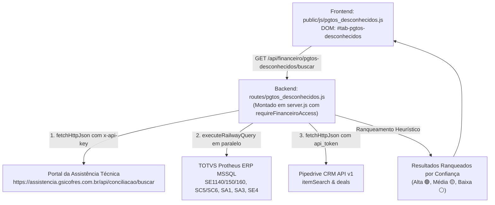

# Localização de Pagamentos Desconhecidos — Assistente Financeiro

> **Macro-Área:** Assist. Financ.  
> **Identificador DOM:** `#tab-pgtos-desconhecidos` | **Botão:** `#btnTabPgtosDesconhecidos`  
> **Permissão RBAC:** `financeiro`, `analista-fin`, `admin`, `diretoria` (Perfil `vendedor` bloqueado via HTTP 403)  
> **Status:** Operacional em Produção  
> **Última Atualização:** 07/10/2026 (v8.300 - Homologado)  

---

## 1. Propósito da Tela & Personas

### 1.1 Objetivo de Negócio
Identificar com rapidez a origem de depósitos e créditos Pix não identificados que caem nas contas correntes do Banco Inter das empresas do Grupo GSI:
- **GSI Cofres (Filial 15)**
- **Metal Pleno (Filial 14)**
- **OAÇO (Filial 16)**

Frequentemente depósitos caem com descrições genéricas no extrato (ex: `PIX RECEBIDO -SILICONE CENTER LTDA R$ 361,00`) onde o titular do Pix não coincide com o nome cadastrado no pedido ou na ordem de serviço, gerando horas de atrito entre o assistente financeiro, assistência técnica e vendedores comerciais.

A tela realiza uma **busca federada e simultânea** em três sistemas:
1. **Portal da Assistência Técnica GSI** (API REST externa com cálculo reverso de Pix à vista com 5% de desconto e cruzamento PF x PJ).
2. **TOTVS Protheus ERP** (Adiantamentos `RA`, títulos em aberto `SE1`, pedidos de venda não faturados `SC5`/`SC6` e vendedores `SA3`).
3. **Pipedrive CRM** (Oportunidades e negócios abertos no funil comercial).

### 1.2 Heurísticas de Negócio por Empresa
- **Empresa 15 (GSI Cofres):** Maior probabilidade na **Assistência Técnica** (Score base elevado + bônus de cálculo reverso 5% Pix), seguida de títulos/pedidos do Protheus e Pipedrive.
- **Empresas 14 (Metal Pleno) e 16 (OAÇO):** A Assistência Técnica **não se aplica** (score é zerado e registros são descartados). A maior probabilidade reside em **pedidos e adiantamentos do Protheus com destaque obrigatório para o Vendedor Comercial responsável**, seguidos por oportunidades abertas no Pipedrive.

### 1.3 Personas Atendidas
- **Assistente Financeiro / Controladoria:** Localiza de onde veio o crédito órfão com 1 clique e copia o resumo estruturado para cobrança/baixa.
- **Equipe Comercial / Vendedores:** Beneficiados pela rápida identificação do adiantamento de entrada de seus pedidos para liberação no Protheus.
- **Administrador do Sistema:** Acompanha trilha de auditoria e garante isolamento Zero-Trust de dados sensíveis.

---

## 2. Arquitetura de Código & Componentes



### Arquivos Envolvidos
- **Frontend:**
  - `public/js/pgtos_desconhecidos.js`: Controlador IIFE modular com estado limpo, formatação monetária, renderização de KPIs, chips de filtro com `aria-pressed`, tabela responsiva, proteção de protocolo em links externos (`/^https?:\/\//i`) e cópia segura com fallback.
  - `public/index.html`: Botão `#btnTabPgtosDesconhecidos` no submenu Financeiro e container `#tab-pgtos-desconhecidos`.
  - `public/app.js`: Injeção do atalho rápido `"🔍 Localizar Origem"` na tabela de órfãos do banco na tela de Conciliação Bancária (`orfaosBanco`).
  - `public/style.css`: Estilização de botões `.btn-xs`, badges `.badge-confianca`, `.badge-origem-tag` e `.badge-empresa-pill`.
- **Backend & Orquestração:**
  - `routes/pgtos_desconhecidos.js`: Roteador Express desacoplado com sanitização de termos, normalização de valores, execução paralela via `Promise.allSettled`, sanitização SQL e motor de score.
  - `server.js`: Montagem segura sob `/api/financeiro/pgtos-desconhecidos` protegida por `requireAuth` e `requireFinanceiroAccess`.

---

## 3. Segurança Zero-Trust & RBAC

1. **Restrição por Perfil:**
   - O perfil `vendedor` é **bloqueado no servidor com HTTP 403 Forbidden**, impedindo consultas arbitrárias a devedores ou informações financeiras restritas.
   - Apenas perfis `admin`, `diretoria` e usuários com permissão `financeiro` ou `analista-fin` podem acessar o endpoint.
2. **Sanitização Contra SQL Injection:**
   - Uso de `sanitizeSqlParam` em todos os parâmetros textuais.
   - Proteção estrita contra bypass de wildcard universal (`LIKE '%%'`), exigindo no mínimo 3 dígitos numéricos para filtros no campo `SA1.A1_CGC`.
3. **Clamping Defensivo de Limites:**
   - O parâmetro `limite` é delimitado entre 1 e 100 (`Math.max(1, Math.min(limite, 100))`), prevenindo exaustão de memória ou ataques de negação de serviço.
4. **Proteção Contra DOM XSS & Protocol Injection:**
   - Todo dado interpolado no HTML passa por `escapeHtml()`.
   - Links para registros externos (OS na Assistência ou Deal no CRM) são verificados contra a regex `/^https?:\/\//i`, bloqueando esquemas maliciosos como `javascript:`.

---

## 4. Regras de Negócio & Algoritmo de Ranqueamento

### 4.1 Limpeza de Ruído Bancário (`limparTermoBancario`)
Remove automaticamente termos comuns de extratos que atrapalham as buscas com limites de palavra (`\b`):
- `DEPOSITO` / `DEPÓSITO` / `DEP.` / `DEP`
- `DEPOSITO EM CONTA` / `DEPOSITO DINHEIRO` / `DEPOSITO IDENTIFICADO`
- `PIX RECEBIDO -` / `PIX RECEBIDO` / `PIX TRANSF` / `PAGTO PIX` / `RECEBIMENTO PIX`
- `TED REMETENTE` / `TED` / `DOC`
- `TRANSF ELET DISP` / `TRANSFERENCIA` / `TRANSF.` / `TRANSF`
- `CREDITO EM CONTA` / `CREDITO` / `CRÉDITO`
- `BOLETO` / `BOL`

### 4.2 Classificação de Score e Confiança (`calcularScoreEConfianca`)
- **Confiança Alta (🟢):** Score $\ge 150$ pontos e diferença de centavos ($\le \text{R\$} 0,05$) em relação ao valor depositado (ex: Título Protheus ou 1ª parcela de Pedido SC5 com valor exato, ou OS com 5% Pix).
- **Confiança Baixa (⚪):** Divergência de valor de até $6,00\%$ em relação ao depósito ($\text{diffPct} \le 6,0\%$). Score delimitado a $< 90$ pontos.
- **Score 0 (Descarte Imediato):** Divergência de valor superior a $6,00\%$ ($\text{diffPct} > 6,0\%$) ou itens da Assistência Técnica para as Empresas 14 (Metal Pleno) e 16 (OAÇO). O registro não figura na listagem retornada.

### 4.3 Filtro Temporal Obrigatório dos Últimos 90 Dias (Mitigação de Poluição Histórica)
Para assegurar que a busca não traga informações antigas e irrelevantes do passado:
1. **Pipedrive CRM:** Utiliza o campo `update_time` ("Atualizado em"), limitando os resultados aos últimos 90 dias. Negociações com atualização anterior a 90 dias são sumariamente descartadas (tanto na busca por valor quanto na busca textual via `itemSearch`).
2. **TOTVS Protheus ERP:** Utiliza a Data de Emissão do título (`E1_EMISSAO`), calculando data de corte em formato `YYYYMMDD` (`E1.E1_EMISSAO >= '<dataCorte>'`). Aplica também a proteção aos pedidos de venda em aberto (`C5.C5_EMISSAO >= '<dataCorte>'`).
3. **Portal da Assistência Técnica:** Utiliza a data do campo "Entrada em:" (campo `data_abertura` / `entrada_em` da API externa), filtrando em memória com a função `isWithinLastDays(dtEntrada, 90)`.

### 4.4 Exclusão Estrita de Títulos Baixados (Apenas Recebimentos em Aberto)
Para evitar falsos positivos e poluição visual com títulos que já foram pagos/liquidados:
1. **Filtro em SQL Server (`SE1`):** A cláusula `WHERE` impõe compulsoriamente `E1.E1_SALDO > 0` e `RTRIM(ISNULL(E1.E1_BAIXA, '')) = ''`, garantindo que apenas títulos com saldo devedor ativo e sem baixa sejam extraídos do Protheus.
2. **Defesa em Profundidade no Backend:** O loop de processamento verifica `isBaixado = (row.BAIXA && row.BAIXA.trim() !== '') || saldo <= 0` e descarta (`continue`) qualquer registro sem saldo ou baixado, impedindo a geração do status `Baixado no Protheus`. Títulos com saldo parcial recebem `Em Aberto (Saldo Parcial)`.
3. **Filtro Preventivo no Frontend:** O método `renderizarTabela` em `public/js/pgtos_desconhecidos.js` descarta preventivamente em memória qualquer item cujo status contenha `'Baixado'`.

### 4.5 Conciliação, Equalização e Importação em Lote de OSs (Protheus ERP x Portal da Assistência)
Além das consultas em tempo real, o ecossistema possui scripts de conciliação em lote e migração para manter a paridade estrita entre o Protheus (`SE1150`) e o Portal da Assistência Técnica (`assistencia.gsicofres.com.br`):
1. **Extração e Identificação de OSs Quitadas no Protheus (`scripts/localizar_os_quitadas.js`):** Varredura em `SE1150` onde `E1_NUM LIKE '%OS%'` e `E1_BAIXA != ''` com saldo devedor quitado integralmente (`E1_SALDO <= 0`). 656 OSs quitadas integrais identificadas.
2. **Atualização em Lote de Status no Portal (`scripts/atualizar_status_portal_lote.js`):** Transição em lote via `PUT /api/os` com pool de concorrência controlada. 573 OSs atualizadas de status `Pendente` para `Confirmado`.
3. **Equalização Exata de Valores (`scripts/equalizar_valores_portal.js`):** Saneamento de 472 OSs que constavam com valor zerado (`R$ 0,00`) ou divergente no portal, igualando ao `E1_VALOR` do Protheus.
4. **Migração e Preenchimento de Peças e Serviços (`scripts/preencher_itens_portal_lote.js`):** Recomposição de 1.168 OSs desprovidas de detalhamento com base nos dados históricos da base OnlineOS.

### 4.6 Regras de Tolerância de 6%, Parcelamento SC5 e Busca Multi-Token
1. **Títulos em Aberto Protheus (`SE1`):**
   - Comparação contra `E1_SALDO` e `E1_VALOR`.
   - Idêntico ($\le \text{R\$} 0,05$): Confiança **Alta (🟢)**.
   - Diferença $\le 6,00\%$: Confiança **Baixa (⚪)**.
   - Diferença $> 6,00\%$: **Descarte sumário**.
2. **Pedidos de Venda Não Faturados (`SC5`):**
   - Divisão automática do total do pedido pelo número de parcelas indicado no início da condição de pagamento (`E4_DESCRI` / `CONDPAG_DESC`):
     - `1x` (ou padrão) $\rightarrow$ divide por 1.
     - `2x` $\rightarrow$ divide por 2.
     - `3x` $\rightarrow$ divide por 3.
     - `4x` $\rightarrow$ divide por 4 (e `Nx` $\rightarrow$ divide por N).
   - O valor da 1ª parcela resultante é comparado ao valor depositado:
     - Exato ($\le \text{R\$} 0,05$): Confiança **Alta (🟢)**.
     - Até $6,00\%$: Confiança **Baixa (⚪)**.
     - Mais de $6,00\%$: **Descarte sumário**.
   - Cláusula permissiva residual (`C5_CONDPAG IN ('001','053') AND C5_FRETE > 0`) eliminada, erradicando pedidos com valores desconexos (ex: R$ 947,40, R$ 1.033,54, R$ 1.019,58).
3. **Busca Textual Multi-Palavra / Tokens no Protheus:**
   - Além do termo contínuo, termos com múltiplas palavras úteis (ex: `"JESMOND VAR"`) são tokenizados para cruzar via `AND` no SQL (`E1_NOMCLI LIKE '%JESMOND%' AND E1_NOMCLI LIKE '%VAR%'`), localizando nomes compostos como `JESMOND COMERCIO VAR`.

### 4.7 Parser Robusto de Linhas de Extrato Bancário & Smart Paste (v8.300)
Para sanar a fricção de operadores que colam linhas brutas inteiras copiadas do extrato bancário ou planilhas (ex: `07/10/2026    CRÉDITO    Pix recebido    PIX RECEBIDO -MADERO INDUSTRIA E COM    R$ 1.220,00`):
1. **Frontend Smart Paste (`tratarPasteExtrato` / `parsearLinhaExtratoFront`):**
   - Interceptação nativa do evento `paste` nos campos `#pgtosValorInput` e `#pgtosTermoInput`.
   - Se a string colada contiver dados múltiplos de extrato (tabs/espaços múltiplos ou datas combinados com valores monetários), o sistema auto-decompõe silenciosamente a linha:
     - Formata e insere o valor monetário (`1.220,00`) no campo `#pgtosValorInput`.
     - Isola a razão social do sacado/pagador limpo (`MADERO INDUSTRIA E COM`) no campo `#pgtosTermoInput`.
2. **Backend Resiliente (`limparTermoBancario` / `parsearLinhaExtrato`):**
   - Remoção de datas em qualquer posição (`DD/MM/AAAA` ou `DD/MM/YY`).
   - Remoção de valores monetários com prefixo `R$` ou posicionados ao final da linha.
   - Remoção de categorias operacionais (`CRÉDITO`, `DÉBITO`, `PIX RECEBIDO`, `TRANSFERÊNCIA RECEBIDA/ENVIADA`, `BOLETO RECEBIDO`, etc.).
   - Remoção de códigos de roteamento bancário, agência e conta (ex: `341 263 993933`, `001 4478 73881`, `Cp :18236120-`, `00019 441662781`).
   - Preservação estrita de identificadores societários sem ruído bancário (CNPJ e CPF íntegros).
   - Tolerância na rota `GET /buscar`: se o parâmetro `valor` for omitido mas o parâmetro `termo` contiver uma linha completa de extrato, o valor é extraído automaticamente sem retornar `HTTP 400`.
3. **Saneamento de Stop Words Bancárias no SQL Protheus:**
   - Termos bancários residuais (`PIX`, `TED`, `DOC`, `TRANSF`, `RECEBIDO`, `CREDITO`, `DEBITO`, etc.) são expurgados do array de tokens, e pontuações periféricas são limpas (`-MADERO` vira `MADERO`), garantindo match imediato em `E1_NOMCLI` e `SA1.A1_NOME`.

---

## 5. Endpoints REST da API

### `GET /api/financeiro/pgtos-desconhecidos/buscar`
- **Headers:** `Authorization: Bearer <JWT>`
- **Query Params:**
  - `valor`: **Obrigatório** (ou embutido na linha bruta de extrato em `termo`). Valor do depósito em formato livre (ex: `'361'`, `'361.00'`, `'R$ 361,00'`). Se ausente e não detectável no termo, retorna `HTTP 400 Bad Request`.
  - `empresa`: `'14'`, `'15'`, `'16'` ou `'ALL'` (default: `'ALL'`).
  - `termo`: Termo opcional de refinamento de busca (Razão social, nome de contato, CNPJ/CPF ou linha bruta de extrato).
  - `limite`: Número máximo de candidatos retornados (default: 30, clamp 1 a 100).

---

## 6. Testes Automatizados Vinculados

A suíte cobre 100% dos requisitos de negócio, heurística e segurança:
```bash
node test_pgtos_desconhecidos.js
```
Total de testes: **63 testes aprovados (0 falhas)**:
- Bloco 1: Limpeza de Prefixos e Termos de Extrato (10 testes)
- Bloco 2: Normalização de Valores Monetários com preservação de sinal (6 testes)
- Bloco 3: Motor de Score e Confiança por Empresa (5 testes)
- Bloco 4: Integridade de Frontend, Marcação HTML e Validação Obrigatória (9 testes)
- Bloco 5: Teste Funcional da Rota Backend Express, Rejeição sem Valor e Clamping (5 testes)
- Bloco 6: Validação de Segurança RBAC e Sanitização SQL (3 testes)
- Bloco 7: Filtros de 90 Dias (Pipedrive update_time, Protheus E1_EMISSAO, Assistência Entrada em) (8 testes)
- Bloco 8: Exclusão Estrita de Títulos Baixados / Somente Recebimentos em Aberto Protheus (3 testes)
- Bloco 9: Parcelamento SC5, Tolerância de 6% e Busca Textual Protheus (5 testes)
- Bloco 10: Parser Robusto de Linhas de Extrato Bancário & Smart Paste (9 testes)

---

## 7. Histórico & Evolução da Tela

- **v8.300 (07/10/2026):** Parser de extrato bancário e Smart Paste na tela Pgtos Desconhecidos: decomposição automática de linhas brutas coladas em valor e razão social limpa no frontend ('paste') e backend (query param), saneamento de roteamentos bancários (`341...`, `001...`, `Cp :...`), suporte a tokens sem pontuação no SQL Protheus e 63 testes aprovados (0 falhas).
- **v8.299 (07/10/2026):** Aplicação da régua de tolerância estrita de até 6% em títulos SE1 e pedidos SC5 (idêntico = Alta 🟢, até 6% = Baixa ⚪, acima de 6% = descarte imediato), cálculo de valor da 1ª parcela em pedidos não faturados SC5 com divisor linear (`1x`, `2x`, `3x`, `4x`), erradicação de pedidos com valores discrepantes (eliminação da cláusula residual em SC5 SQL), correção do parser de ruído bancário (`DEPOSITO`, `DEP.`, `DEPOSITO EM CONTA`) e busca textual tokenizada multi-palavras para Protheus (`JESMOND COMERCIO VAR`). Chip "⚪ Baixa" adicionado na interface. Suíte expandida para 54 testes aprovados (0 falhas).
- **v8.298 (07/10/2026):** Conciliação e sincronização em lote de OSs Protheus x Portal da Assistência: 573 OSs quitadas atualizadas para status 'Confirmado', 472 OSs com valor zerado equalizadas com o Protheus (`E1_VALOR`) e 1.168 OSs recompostas com descrições, quantidades e valores de peças/serviços da base OnlineOS legada, com exclusão auditada de títulos não quitados e parciais (OS 1297).
- **v8.297 (07/10/2026):** Exclusão estrita de títulos com status 'Baixado no Protheus' e campo de valor obrigatório na listagem de pagamentos desconhecidos. Apenas recebimentos em aberto (`E1_SALDO > 0` e `E1_BAIXA` vazia) são consultados e exibidos, tanto no SQL de SE1 quanto na defesa em profundidade do backend e frontend. Suíte ampliada para 45 testes aprovados.
- **v8.295 (07/10/2026):** Campo 'Valor do Depósito (R$)' tornado estritamente obrigatório tanto no frontend (marcação `*`, `required`, foco automático e alertas amigáveis) quanto na API backend (`HTTP 400` se ausente ou $\le 0$). Expansão da suíte para 42 testes aprovados.
- **v8.294 (07/10/2026):** Implementação dos filtros temporais de 90 dias para conter registros do passado: Pipedrive CRM (`update_time`), Protheus ERP (`E1_EMISSAO` e `C5_EMISSAO`) e Assistência Técnica ("Entrada em:"), formatação limpa de datas e expansão da suíte para 38 testes.
- **v8.293 (06/10/2026):** Implantação completa da sub-aba Pgtos Desconhecidos na macro-área Assist. Financ., busca federada na Assistência Técnica, Protheus ERP e Pipedrive CRM, heurísticas por empresa, atalho na conciliação de órfãos do banco e proteção RBAC Zero-Trust.
