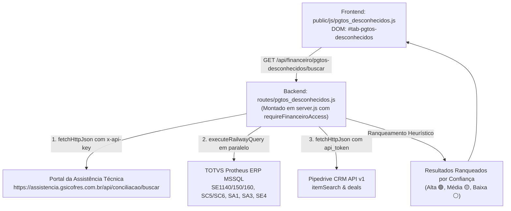

# Localização de Pagamentos Desconhecidos — Assistente Financeiro

> **Macro-Área:** Assist. Financ.  
> **Identificador DOM:** `#tab-pgtos-desconhecidos` | **Botão:** `#btnTabPgtosDesconhecidos`  
> **Permissão RBAC:** `financeiro`, `analista-fin`, `admin`, `diretoria` (Perfil `vendedor` bloqueado via HTTP 403)  
> **Status:** Operacional em Produção  
> **Última Atualização:** 06/10/2026 (v8.293 - Homologado)  

---

## 1. Propósito da Tela & Personas

### 1.1 Objetivo de Negócio
Identificar com rapidez a origem de depósitos e créditos Pix não identificados que caem nas contas correntes do Banco Inter das empresas do Grupo GSI:
- **GSI Cofres (Filial 15)**
- **Metal Pleno (Filial 14)**
- **OAÇO (Filial 16)**

Frequentemente depósitos caem com descrições genéricas no extrato (ex: `PIX RECEBIDO -SILICONE CENTER LTDA R$ 361,00`) onde o titular do Pix não coincide com o nome cadastrado no pedido ou na ordem de serviço, gerando horas de atrito entre o assistente financeiro, assistência técnica e vendedores comerciais.

A tela realiza uma **busca federada e simultânea** em três sistemas:
1. **Portal da Assistência Técnica GSI** (API REST externa com cálculo reverso de Pix à vista com 5% de desconto e cruzamento PF x PJ).
2. **TOTVS Protheus ERP** (Adiantamentos `RA`, títulos em aberto `SE1`, pedidos de venda não faturados `SC5`/`SC6` e vendedores `SA3`).
3. **Pipedrive CRM** (Oportunidades e negócios abertos no funil comercial).

### 1.2 Heurísticas de Negócio por Empresa
- **Empresa 15 (GSI Cofres):** Maior probabilidade na **Assistência Técnica** (Score base elevado + bônus de cálculo reverso 5% Pix), seguida de títulos/pedidos do Protheus e Pipedrive.
- **Empresas 14 (Metal Pleno) e 16 (OAÇO):** A Assistência Técnica **não se aplica** (score é zerado e registros são descartados). A maior probabilidade reside em **pedidos e adiantamentos do Protheus com destaque obrigatório para o Vendedor Comercial responsável**, seguidos por oportunidades abertas no Pipedrive.

### 1.3 Personas Atendidas
- **Assistente Financeiro / Controladoria:** Localiza de onde veio o crédito órfão com 1 clique e copia o resumo estruturado para cobrança/baixa.
- **Equipe Comercial / Vendedores:** Beneficiados pela rápida identificação do adiantamento de entrada de seus pedidos para liberação no Protheus.
- **Administrador do Sistema:** Acompanha trilha de auditoria e garante isolamento Zero-Trust de dados sensíveis.

---

## 2. Arquitetura de Código & Componentes



### Arquivos Envolvidos
- **Frontend:**
  - `public/js/pgtos_desconhecidos.js`: Controlador IIFE modular com estado limpo, formatação monetária, renderização de KPIs, chips de filtro com `aria-pressed`, tabela responsiva, proteção de protocolo em links externos (`/^https?:\/\//i`) e cópia segura com fallback.
  - `public/index.html`: Botão `#btnTabPgtosDesconhecidos` no submenu Financeiro e container `#tab-pgtos-desconhecidos`.
  - `public/app.js`: Injeção do atalho rápido `"🔍 Localizar Origem"` na tabela de órfãos do banco na tela de Conciliação Bancária (`orfaosBanco`).
  - `public/style.css`: Estilização de botões `.btn-xs`, badges `.badge-confianca`, `.badge-origem-tag` e `.badge-empresa-pill`.
- **Backend & Orquestração:**
  - `routes/pgtos_desconhecidos.js`: Roteador Express desacoplado com sanitização de termos, normalização de valores, execução paralela via `Promise.allSettled`, sanitização SQL e motor de score.
  - `server.js`: Montagem segura sob `/api/financeiro/pgtos-desconhecidos` protegida por `requireAuth` e `requireFinanceiroAccess`.

---

## 3. Segurança Zero-Trust & RBAC

1. **Restrição por Perfil:**
   - O perfil `vendedor` é **bloqueado no servidor com HTTP 403 Forbidden**, impedindo consultas arbitrárias a devedores ou informações financeiras restritas.
   - Apenas perfis `admin`, `diretoria` e usuários com permissão `financeiro` ou `analista-fin` podem acessar o endpoint.
2. **Sanitização Contra SQL Injection:**
   - Uso de `sanitizeSqlParam` em todos os parâmetros textuais.
   - Proteção estrita contra bypass de wildcard universal (`LIKE '%%'`), exigindo no mínimo 3 dígitos numéricos para filtros no campo `SA1.A1_CGC`.
3. **Clamping Defensivo de Limites:**
   - O parâmetro `limite` é delimitado entre 1 e 100 (`Math.max(1, Math.min(limite, 100))`), prevenindo exaustão de memória ou ataques de negação de serviço.
4. **Proteção Contra DOM XSS & Protocol Injection:**
   - Todo dado interpolado no HTML passa por `escapeHtml()`.
   - Links para registros externos (OS na Assistência ou Deal no CRM) são verificados contra a regex `/^https?:\/\//i`, bloqueando esquemas maliciosos como `javascript:`.

---

## 4. Regras de Negócio & Algoritmo de Ranqueamento

### 4.1 Limpeza de Ruído Bancário (`limparTermoBancario`)
Remove automaticamente termos comuns de extratos que atrapalham as buscas:
- `PIX RECEBIDO -` / `PIX RECEBIDO`
- `TED REMETENTE`
- `TRANSF ELET DISP`
- `PAGTO PIX`
- `DEP EM DINHEIRO`

### 4.2 Classificação de Score e Confiança (`calcularScoreEConfianca`)
- **Confiança Alta (🟢):** Score $\ge 150$ pontos (ex: OS identificada com desconto de 5% Pix ou Título Protheus com match exato de valor e cliente).
- **Confiança Média (🟡):** Score entre $90$ e $149$ pontos (ex: Oportunidade no CRM ou Pedido em Aberto sem adiantamento confirmado).
- **Confiança Baixa (⚪):** Score $< 90$ pontos.
- **Score 0 (Descarte):** Itens da Assistência Técnica para as Empresas 14 (Metal Pleno) e 16 (OAÇO) são descartados automaticamente da listagem.

---

## 5. Endpoints REST da API

### `GET /api/financeiro/pgtos-desconhecidos/buscar`
- **Headers:** `Authorization: Bearer <JWT>`
- **Query Params:**
  - `empresa`: `'14'`, `'15'`, `'16'` ou `'ALL'` (default: `'ALL'`).
  - `valor`: Valor em formato livre (ex: `'361'`, `'361.00'`, `'R$ 361,00'`).
  - `termo`: Termo de busca (Razão social, nome de contato, CNPJ/CPF ou texto de extrato).
  - `limite`: Número máximo de candidatos retornados (default: 30, clamp 1 a 100).

---

## 6. Testes Automatizados Vinculados

A suíte cobre 100% dos requisitos de negócio, heurística e segurança:
```bash
node test_pgtos_desconhecidos.js
```
Total de testes: **30 testes aprovados (0 falhas)**:
- Bloco 1: Limpeza de Prefixos e Termos de Extrato (7 testes)
- Bloco 2: Normalização de Valores Monetários (5 testes)
- Bloco 3: Motor de Score e Confiança por Empresa (4 testes)
- Bloco 4: Integridade de Frontend e Marcação HTML (8 testes)
- Bloco 5: Teste Funcional da Rota Backend Express & Clamping (3 testes)
- Bloco 6: Validação de Segurança RBAC e Sanitização SQL (3 testes)

---

## 7. Histórico & Evolução da Tela

- **v8.293 (06/10/2026):** Implantação completa da sub-aba Pgtos Desconhecidos na macro-área Assist. Financ., busca federada na Assistência Técnica, Protheus ERP e Pipedrive CRM, heurísticas por empresa, atalho na conciliação de órfãos do banco e proteção RBAC Zero-Trust.
