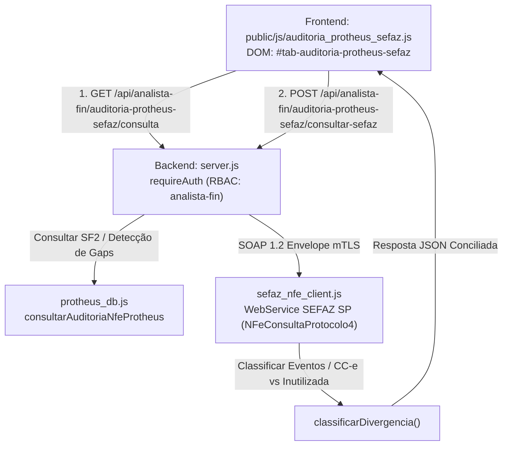
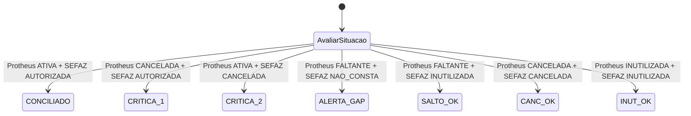

# Auditoria Protheus x SEFAZ — Analista Financeiro & Fiscal

> **Documentação Técnica Modular — Portal GSI**  
> Módulo de Auditoria Contínua, Detecção de Gaps de Numeração e Conciliação Protheus ERP x SEFAZ SP.

---

## 📋 Identificação da Tela

| Atributo | Especificação |
| :--- | :--- |
| **Macro-Área / Pasta** | `docs/telas/07_analista_fin/` (Analista Financeiro & Fiscal) |
| **Nome da Tela** | Auditoria de Sequência & Conciliação Protheus x SEFAZ |
| **Tab ID DOM** | `#tab-auditoria-protheus-sefaz` |
| **Botão de Acesso DOM** | `#btnTabAuditoriaProtheusSefaz` |
| **Permissão RBAC** | `analista-fin`, `admin` |
| **Versão / Data** | v2.1 — Setembro/2026 |
| **Status Operacional** | 🟢 Produção Homologada |

---

## 1. Propósito da Tela & Personas

### 1.1 Objetivo de Negócio
A tela de **Auditoria Protheus x SEFAZ** resolve uma das vulnerabilidades fiscais mais críticas de qualquer indústria ou distribuidora: a falta de sincronia entre o ERP local e os servidores da Secretaria da Fazenda (SEFAZ). Divergências entre esses dois sistemas geram riscos de autuação fiscal por:
1. **Pulos ou Saltos de Numeração (Gaps):** Quando uma NF-e é pulada pelo sistema de faturamento sem a devida homologação de inutilização legal perante o Fisco.
2. **Falsos Cancelamentos ou Descompasso:** Notas que foram canceladas no Protheus, mas continuam constando como autorizadas na SEFAZ (ou vice-versa).
3. **Erros de Interpretação de Eventos:** Notas fiscais autorizadas que receberam Carta de Correção Eletrônica (CC-e) sendo erroneamente tratadas como inutilizadas ou canceladas.

A ferramenta audita a sequência numérica contínua, consulta a SEFAZ via WebService SOAP 1.2 em lote e classifica automaticamente a situação tributária de cada documento fiscal emitido.

### 1.2 Personas Envolvidas
- **Analista Fiscal (ex: Érica):** Executa a verificação periódica (semanal/mensal) da integridade da sequência de notas para evitar passivos perante o Fisco.
- **Analista de Sistemas / Protheus (TI):** Acionado caso sejam detectados descompassos no TSS (Totvs Sped Service) ou falhas na transmissão das notas fiscais.
- **Auditor Externo / Contabilidade:** Consulta os relatórios exportados para conferência de livros fiscais (SPED Fiscal / EFD ICMS-IPI).

### 1.3 Fluxo Operacional Típico
1. O usuário seleciona a **Empresa** (`14 - Metal Pleno`, `15 - GSI Brasil` ou `16 - OACO`).
2. O sistema preenche a **Série** padrão (`1`) e as datas do **mês anterior completo** (ex: `01/08/2026` a `31/08/2026`).
3. O analista clica em **"1. Carregar Protheus"**: o backend busca todas as notas emitidas na tabela `SF2`, identifica o menor e maior número da série no período e detecta quaisquer números faltantes (gaps).
4. O grid exibe a lista completa de documentos com os status Protheus (`ATIVA`, `CANCELADA`, `INUTILIZADA` ou `FALTANTE`).
5. O analista clica em **"2. Consultar SEFAZ (Lote)"**: o backend dispara chamadas SOAP autenticadas para o WebService `NFeConsultaProtocolo4` da SEFAZ SP para cada nota/chave de acesso.
6. A matriz de divergências é processada instantaneamente, destacando notas conciliadas, avisos de inutilização e divergências críticas em vermelho.
7. O usuário pode filtrar o grid por status (ex: apenas `DIVERGENCIAS`) e acionar **"Exportar CSV"** para documentar as providências a serem tomadas.

---

## 2. Arquitetura de Código & Componentes



### 2.1 Estrutura Frontend
- **Arquivo de Script:** [`public/js/auditoria_protheus_sefaz.js`](file:///C:/Users/Alexandre/Documents/Gemini-Cli/public/js/auditoria_protheus_sefaz.js) (640 linhas, arquitetura isolada com gerenciamento de estado local).
- **Container DOM:** `#tab-auditoria-protheus-sefaz` em [`public/index.html`](file:///C:/Users/Alexandre/Documents/Gemini-Cli/public/index.html).
- **Componentes Visuais Chave:**
  - `#selAuditoriaEmpresa`: Seletor de empresa filial.
  - `#inputAuditoriaSerie`: Input de série fiscal (default `1`).
  - `#inputAuditoriaDataDe` e `#inputAuditoriaDataAte`: Intervalo de datas.
  - `#selAuditoriaFiltroStatus`: Filtro rápido de exibição (`TODOS`, `DIVERGENCIAS`, `ATIVAS`, `CANCELADAS`, `INUTILIZADAS`, `FALTANTES`).
  - Botões de Ação: `#btnCarregarAuditoriaProtheus`, `#btnConsultarAuditoriaSefaz` e `#btnExportarAuditoriaCsv`.
  - Cards de KPIs do Fechamento:
    - `#kpiAuditoriaTotalFaixa`: Total de números contidos na faixa ($\text{Max} - \text{Min} + 1$).
    - `#kpiAuditoriaAtivas`: Notas ativas no Protheus.
    - `#kpiAuditoriaCanceladas`: Notas canceladas no Protheus.
    - `#kpiAuditoriaInutilizadas`: Notas inutilizadas registradas.
    - `#kpiAuditoriaFaltantes`: Pulos de numeração identificados (gaps).
    - `#kpiAuditoriaDivergencias`: Quantidade de discrepâncias ativas x SEFAZ.
  - Tabela: `#tbodyAuditoriaProtheusSefaz` com tags visuais explicativas e protocolos de autorização.

### 2.2 Estrutura Backend & Comunicação SEFAZ
- **Servidor HTTP:** Endpoints em [`server.js`](file:///C:/Users/Alexandre/Documents/Gemini-Cli/server.js).
- **Módulo de Comunicação SEFAZ:** [`sefaz_nfe_client.js`](file:///C:/Users/Alexandre/Documents/Gemini-Cli/sefaz_nfe_client.js):
  - Endereçamento oficial: `https://nfe.fazenda.sp.gov.br/ws/nfeconsultaprotocolo4.asmx`.
  - Montagem de envelopes SOAP 1.2 com proteção estrita contra quebras de linha (`anti-588`).
  - Parser robusto tolerante a XML puro ou entidades escapadas (`&lt;cStat&gt;100&lt;/cStat&gt;`).
  - Mapeamento completo dos códigos de status do manual nacional da NF-e (`CSTAT_MAP`).

---

## 3. Banco de Dados & Modelagem

### 3.1 Protheus ERP (MSSQL)
A consulta de auditoria acessa as tabelas de notas de saída e livros fiscais:
- `SF2010` (Cabeçalho de Notas de Saída):
  - `F2_DOC`: Número sequencial da NF-e (9 dígitos alfanuméricos convertidos em inteiro para ordenação).
  - `F2_SERIE`: Série da nota fiscal (geralmente `1`).
  - `F2_EMISSAO`: Data de emissão (`AAAAMMDD`).
  - `F2_VALBRUT`: Valor bruto da nota fiscal.
  - `F2_CHVNFE`: Chave de acesso de 44 dígitos da NF-e.
  - `F2_STATUS`: Flag de status Protheus (`A` = Ativa, `C` = Cancelada, etc.).
- `SF3010` (Livros Fiscais): Consulta cruzada para conferência de notas canceladas ou estornadas.
- `SPED050` / `SPED054` (TSS - Totvs Sped Service): Registro de eventos e protocolos homologados pela SEFAZ.

---

## 4. Regras de Negócio & Cálculos Chave

### 4.1 Detecção Algorítmica de Gaps na Sequência Numérica
Para auditar a continuidade exigida pelo Regulamento do ICMS:
1. Ordena-se o conjunto de notas localizadas: $N_1, N_2, \dots, N_k$.
2. Define-se o menor número $\min(N)$ e o maior número $\max(N)$.
3. Itera-se linearmente por todos os inteiros da faixa $[\min(N), \max(N)]$.
4. Se um inteiro $i$ não existe na coleção do Protheus, cria-se um registro virtual de lacuna:
   ```javascript
   {
     num: i,
     status: 'FALTANTE',
     isGap: true,
     descricao: 'Salto na numeração de NF-e detectado no Protheus'
   }
   ```
5. Total da Faixa Auditada:
   $$\text{Total Faixa} = \max(N) - \min(N) + 1$$

### 4.2 Distinção Estrita entre Carta de Correção (CC-e) e Inutilização
Uma das principais fontes de falso positivo na apuração fiscal é a interpretação incorreta do retorno SOAP da SEFAZ quando uma nota autorizada possui eventos vinculados (`procEventoNFe`).

| Cenário | Tag SEFAZ | `cStat` | Status Resultante | Rótulo Visual | Ação Fiscal |
| :--- | :--- | :--- | :--- | :--- | :--- |
| **Nota Autorizada Normal** | `<cStat>100</cStat>` | `100` | `AUTORIZADA` | `Autorizada` | Conciliada OK |
| **Nota com Carta de Correção** | `<tpEvento>110110</tpEvento>` | `100` | `AUTORIZADA` | `Autorizada (CC-e)` | Conciliada OK (Manter NF Ativa) |
| **Cancelamento Homologado** | `<tpEvento>110111</tpEvento>` ou `101` | `101` | `CANCELADA` | `Cancelada` | Confirmar cancelamento no Protheus |
| **Inutilização Homologada** | `<cStat>102</cStat>` | `102` | `INUTILIZADA` | `Inutilizada` | Salto de numeração justificado legalmente |

> [!IMPORTANT]
> O parser em [`sefaz_nfe_client.js`](file:///C:/Users/Alexandre/Documents/Gemini-Cli/sefaz_nfe_client.js) preserva obrigatoriamente o status `AUTORIZADA` com flag `temCce = true` quando detecta o evento `tpEvento = 110110`. A nota **jamais** é rebaixada para `INUTILIZADA` nem apontada como divergência contra uma NF ativa no Protheus.

### 4.3 Matriz Completa de Divergências Fiscais (`classificarDivergencia`)



| Protheus | SEFAZ SP | Gravidade | Diagnóstico / Tipo | Rótulo Exibido no Grid |
| :--- | :--- | :--- | :--- | :--- |
| `ATIVA` | `AUTORIZADA` | `OK` | `CONCILIADO` | `✅ CONCILIADO` |
| `CANCELADA` | `AUTORIZADA` | 🔴 `CRITICA` | `CANCELADA_PROTHEUS_ATIVA_SEFAZ` | `🚨 CANCELADA PROTHEUS / ATIVA SEFAZ` |
| `ATIVA` | `CANCELADA` | 🔴 `CRITICA` | `ATIVA_PROTHEUS_CANCELADA_SEFAZ` | `🚨 ATIVA PROTHEUS / CANCELADA SEFAZ` |
| `FALTANTE` | `NAO_CONSTA` | 🟡 `ALERTA` | `NUMERACAO_FALTANTE` | `⚠️ NUMERAÇÃO FALTANTE (GAP)` |
| `FALTANTE` | `INUTILIZADA` | `OK` | `SALTO_INUTILIZADO` | `✅ SALTO DEVIDAMENTE INUTILIZADO` |
| `CANCELADA` | `CANCELADA` | `OK` | `CANCELAMENTO_CONFIRMADO` | `✅ CANCELAMENTO CONFIRMADO` |
| `CANCELADA` | `NAO_CONSTA` | `OK` | `CANCELADA_NAO_CONSTA` | `✅ SEM RISCO FISCAL (217)` |
| `INUTILIZADA`| `INUTILIZADA`| `OK` | `INUTILIZACAO_CONFIRMADA` | `✅ INUTILIZAÇÃO CONFIRMADA` |
| `INUTILIZADA`| `NAO_CONSTA` | `OK` | `INUTILIZACAO_CONFIRMADA` | `✅ INUTILIZAÇÃO CONFIRMADA` |
| `ATIVA` | `NAO_CONSTA` | 🟡 `ALERTA` | `ATIVA_PROTHEUS_NAO_CONSTA_SEFAZ`| `⚠️ ATIVA PROTHEUS / NÃO CONSTA SEFAZ` |

---

## 5. Endpoints REST da API

### 5.1 `GET /api/analista-fin/auditoria-protheus-sefaz/consulta`
- **Descrição:** Extrai do Protheus todas as notas fiscais da empresa/série no intervalo e computa os gaps de numeração.
- **Autenticação:** `Bearer JWT` (Permissão: `analista-fin` ou `admin`).
- **Query Params:**
  - `empresa`: `14`, `15` ou `16`.
  - `serie`: default `1`.
  - `dataDe`: Data início (`AAAA-MM-DD`).
  - `dataAte`: Data fim (`AAAA-MM-DD`).
- **Exemplo de Resposta (HTTP 200):**
  ```json
  {
    "ok": true,
    "empresa": "14",
    "serie": "1",
    "faixa": { "min": 100, "max": 105 },
    "kpis": {
      "totalFaixa": 6,
      "totalRegistros": 6,
      "ativas": 2,
      "canceladas": 1,
      "inutilizadas": 1,
      "faltantes": 2,
      "divergencias": 0
    },
    "itens": [
      {
        "num": 100,
        "serie": "1",
        "statusProtheus": "ATIVA",
        "chaveAcesso": "35260861237790000118550010000001001608995241",
        "valor": 1500.00,
        "emissao": "01/08/2026",
        "isGap": false
      },
      {
        "num": 102,
        "serie": "1",
        "statusProtheus": "FALTANTE",
        "chaveAcesso": "",
        "valor": 0,
        "isGap": true
      }
    ]
  }
  ```

### 5.2 `POST /api/analista-fin/auditoria-protheus-sefaz/consultar-sefaz`
- **Descrição:** Envia as chaves de acesso em lote para consulta autenticada via WebService SOAP 1.2 da SEFAZ SP.
- **Request Body:**
  ```json
  {
    "empresa": "14",
    "chaves": [
      "35260861237790000118550010000006521608995249"
    ]
  }
  ```
- **Resposta Sucesso (HTTP 200):**
  ```json
  {
    "ok": true,
    "totalConsultadas": 1,
    "resultados": {
      "35260861237790000118550010000006521608995249": {
        "sucesso": true,
        "cStat": "100",
        "status": "AUTORIZADA",
        "rotulo": "Autorizada (CC-e)",
        "temCce": true,
        "protocolo": "135263282224493",
        "xMotivo": "Autorizado o uso da NF-e",
        "dhRecbto": "2026-08-12T09:05:00-03:00"
      }
    }
  }
  ```

---

## 6. Testes Automatizados Vinculados

A conformidade algorítmica e a precisão das chamadas SOAP são garantidas por:

| Arquivo de Teste | Quantidade de Testes | Principais Verificações |
| :--- | :--- | :--- |
| [`test_auditoria_protheus_sefaz.js`](file:///C:/Users/Alexandre/Documents/Gemini-Cli/test_auditoria_protheus_sefaz.js) | 8 Testes | Cálculo de datas de mês anterior, detecção algorítmica de gaps, matriz de divergências, envelope SOAP 1.2 sem CRLF (`anti-588`), parser XML puro/escapado, garantia CC-e 110110 vs Inutilizada 102, validação de chaves inválidas (44 dígitos) e integridade sintática via `vm.Script`. |

### Comando de Execução dos Testes:
```bash
node test_auditoria_protheus_sefaz.js
```

---

## 7. Histórico Recente da Tela

| Versão | Data | Autor | Principais Alterações |
| :--- | :--- | :--- | :--- |
| **v2.1** | 2026-09-14 | Alexandre / Equipe GSI | Implementação da regra de distinção estrita de Carta de Correção (`tpEvento 110110`), eliminando falsos positivos de Inutilizada. |
| **v2.0** | 2026-09-10 | Alexandre / Equipe GSI | Removido rótulo ambíguo `/ OUTRO` na matriz de classificação de divergências e implementado suporte a XMLs escapados em WebServices ASMX. |
| **v1.2** | 2026-09-06 | Alexandre / Equipe GSI | Adição do tratamento `anti-588` (remoção estrita de quebras de linha no envelope SOAP 1.2). |
| **v1.0** | 2026-08-28 | Alexandre / Equipe GSI | Criação inicial da tela de auditoria de sequência de NF-e e detecção de gaps no Protheus. |
