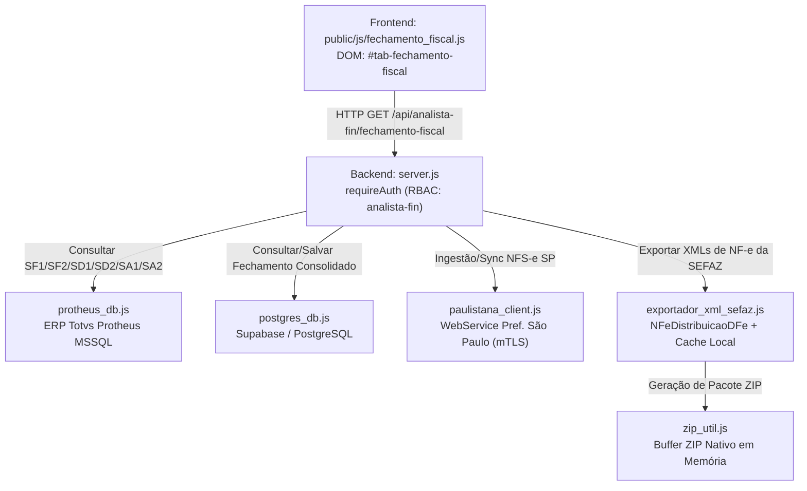
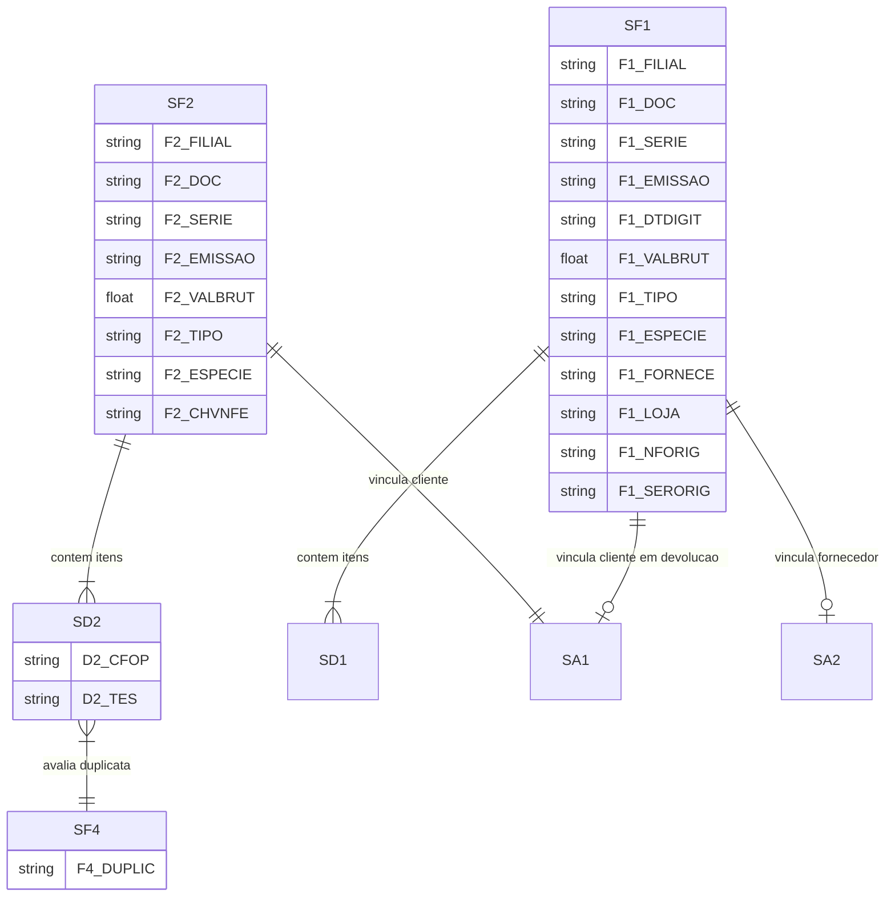

# Fechamento Fiscal Mensal — Analista Financeiro & Fiscal

> **Documentação Técnica Modular — Portal GSI**  
> Módulo de Fechamento Fiscal, Apuração de Faturamento Bruto, RBT12 e Gestão de NFS-e Nota Paulistana SP.

---

## 📋 Identificação da Tela

| Atributo | Especificação |
| :--- | :--- |
| **Macro-Área / Pasta** | `docs/telas/07_analista_fin/` (Analista Financeiro & Fiscal) |
| **Nome da Tela** | Fechamento Fiscal Mensal Multiempresa & Apuração RBT12 |
| **Tab ID DOM** | `#tab-fechamento-fiscal` |
| **Botão de Acesso DOM** | `#btnTabFechamentoFiscal` |
| **Permissão RBAC** | `analista-fin`, `admin` |
| **Versão / Data** | v2.7 — 17/09/2026 |
| **Status Operacional** | 🟢 Produção Homologada (Super Tabela nfe_central_documentos + Job 12:30/18:30) |

---

## 1. Propósito da Tela & Personas

### 1.1 Objetivo de Negócio
A tela de **Fechamento Fiscal Mensal** foi desenvolvida para automatizar, consolidar e auditar toda a apuração de entradas, saídas e faturamento tributável das três filiais do grupo econômico:
- **Empresa 14:** Metal Pleno Comércio de Fechaduras e Ferragens
- **Empresa 15:** GSI Brasil Prestação de Serviços e Manutenção de Cofres
- **Empresa 16:** OACO Indústria e Comércio de Cofres

Historicamente, essa apuração exigia exportações manuais massivas do ERP Totvs Protheus para planilhas eletrônicas (como a planilha homologada `REL GERAL OACO AGOSTO 2026.xlsx`), demandando horas de conciliação entre tipos de documento (`SPED`, `CTR`, `NFS`, `IMP`), tratamento manual de devoluções com formulário próprio e exclusão artesanal de romaneios internos (`ROMA`). 

A funcionalidade consolida em segundos:
1. **Total Tributado Real:** Faturamento contábil tributável para geração das guias do Simples Nacional (DAS) ou apuração do Lucro Presumido.
2. **Histórico RBT12:** Acumulado das 12 competências anteriores contínuas para enquadramento nas faixas de alíquota do Simples Nacional.
3. **Módulo de NFS-e Nota Paulistana (SP):** Captura direta via mTLS, importação em lote e exportação de XMLs em arquivo compactado `.zip` para a Empresa 15.
4. **Exportação de XMLs de NF-e Mercantil (SEFAZ):** Download em lote de arquivos XML oficiais (`<nfeProc>`) das notas filtradas por `SPED & NFE` via WebService Ambiente Nacional com cache em disco (`exportador_xml_sefaz.js`).

### 1.2 Personas Envolvidas
- **Analista Fiscal / Financeiro (ex: Érica):** Responsável primária pelo fechamento mensal, auditoria de notas fiscais, verificação de CFOPs e envio dos relatórios consolidados à contabilidade.
- **Gerente Financeiro / Controladoria (ex: Rubens / Alexandre):** Validação dos valores de faturamento bruto, margem tributária e aprovação final da consolidação mensal.
- **Contabilidade Externa (Escritório Contábil):** Consumidor final das informações apuradas, arquivos XML de NFS-e e relatórios para geração das guias de tributos federais e municipais.

### 1.3 Fluxo Operacional Típico
1. O analista seleciona a **Empresa** (`14 - Metal Pleno`, `15 - GSI Brasil` ou `16 - OACO`).
2. O sistema sugere automaticamente o intervalo de datas do **mês anterior completo** (ex: `01/08/2026` a `31/08/2026`).
3. O usuário seleciona o critério de data para Entradas: **Data de Emissão** (padrão contábil) ou **Data de Digitação** (registro no Protheus).
4. Clica em **"Consultar Fechamento"**: os dados são extraídos em tempo real do banco MSSQL do Protheus, totalizados e exibidos no painel de KPIs e grid de notas.
5. (Se Empresa 15) O usuário aciona **"Sincronizar NFS-e SP"** ou faz upload de arquivo `.xml` / `.txt` da Prefeitura de São Paulo para incorporar serviços prestados.
6. O analista revisa os cards de KPIs (Saídas, Devoluções, Remessas, Serviços, Entradas, CTRs, Impostos e RBT12).
7. Seleciona o filtro `SPED & NFE` no seletor de tipo de documento: o botão compacto **"Exportar XML"** surge na mesma linha da barra de filtros rápidos.
8. Clica em **"Exportar XML"** para abrir o modal de confirmação e disparar o download do lote compactado `.zip` com os arquivos XML da SEFAZ.
9. Clica em **"Consolidar Fechamento"** para congelar o período e registrar o log de auditoria no PostgreSQL/Supabase.

---

## 2. Arquitetura de Código & Componentes



### 2.1 Estrutura Frontend
- **Arquivo de Script:** [`public/js/fechamento_fiscal.js`](file:///C:/Users/Alexandre/Documents/Gemini-Cli/public/js/fechamento_fiscal.js) (estruturado em IIFE modular estrita).
- **Container DOM:** `#tab-fechamento-fiscal` em [`public/index.html`](file:///C:/Users/Alexandre/Documents/Gemini-Cli/public/index.html).
- **Componentes Visuais Chave:**
  - `#selFechamentoEmpresa`: Seletor de empresa (`14`, `15`, `16`).
  - `#inputFechamentoDataDe` e `#inputFechamentoDataAte`: Seletores de data com inicialização automatizada para o primeiro e último dia do mês anterior.
  - `#selCriterioDataEntrada`: Alternância entre `EMISSAO` (F1_EMISSAO) e `DIGITACAO` (F1_DTDIGIT).
  - `#inputBuscaFechamento`: Campo de busca rápida no grid (largura responsiva compacta `max-width: 300px; min-width: 180px`).
  - `#selFiltroTipoFechamento`: Filtro instantâneo por fluxo/natureza (`ALL` - Todos, `SAIDA`, `ENTRA`, `DEVOLUCAO`, `SERVICO`, `TRIBUTADO`, `NAO_TRIBUTADO`).
  - `#selFiltroDocFechamento`: Filtro instantâneo por tipo de documento (`ALL` - Todos, `SPED_NFE` - SPED & NFE conjuntos, `SPED`, `NFE`, `CTR`, `NFS`, `IMP`, `DAS`, `NTST`).
  - `#btnExportarXmlFechamento`: Botão compacto na mesma linha do filtro, acionado exclusivamente quando `SPED & NFE` está selecionado.
  - `#modalExportarXmlNfe`: Modal com resumo de notas, campo de senha do certificado A1 e barra de progresso.
  - Grid de Resultados: Tabela com `#tbodyFechamentoFiscal`, colunas com badges coloridos de operação e indicador explícito de incidência tributária (`Gera Imposto: Sim/Não`).
  - Painel de Metadados Consolidados: Exibição de carimbo com data, hora e usuário responsável pela última consolidação.

### 2.2 Estrutura Backend & Serviços
- **Servidor HTTP:** Endpoints sob o prefixo `/api/analista-fin/fechamento-fiscal` no [`server.js`](file:///C:/Users/Alexandre/Documents/Gemini-Cli/server.js).
- **Middleware de Proteção:** `requireAuth` validando token Bearer e verificando se a lista de permissões do usuário contém `analista-fin` ou o papel de `admin`.
- **Motor Protheus:** Funções `consultarFechamentoFiscalProtheus` e `obterHistoricoFaturamento12MesesProtheus` no [`protheus_db.js`](file:///C:/Users/Alexandre/Documents/Gemini-Cli/protheus_db.js).
- **Exportador SEFAZ Modular:** [`exportador_xml_sefaz.js`](file:///C:/Users/Alexandre/Documents/Gemini-Cli/exportador_xml_sefaz.js) para conexão mTLS com Ambiente Nacional da SEFAZ (`NFeDistribuicaoDFe`), descompressão `docZip` (gzip) e cache local permanente em `data/xml_nfe_cache/`.
- **Cliente Nota Paulistana:** [`paulistana_client.js`](file:///C:/Users/Alexandre/Documents/Gemini-Cli/paulistana_client.js) para conexão mTLS SOAP com a Prefeitura de São Paulo e parsers XML/TXT de lote.
- **Utilitário de Compressão:** [`zip_util.js`](file:///C:/Users/Alexandre/Documents/Gemini-Cli/zip_util.js) gerador de arquivos ZIP com CRC-32 nativo sem binários nativos ou dependências do sistema operacional.
- **Repositório Relacional:** [`postgres_db.js`](file:///C:/Users/Alexandre/Documents/Gemini-Cli/postgres_db.js) para persistência em Supabase com fallback JSON local (`data/fechamentos_fiscais.json`).

---

## 3. Banco de Dados & Modelagem

### 3.1 Protheus ERP (MSSQL)

A consulta ao Protheus integra tabelas fiscais nativas com saneamento de exclusões lógicas (`D_E_L_E_T_ = ' '`):



#### Destaques de Mapeamento SQL:
1. **Saídas (SF2 + SD2 + SF4 + SA1):**
   - Agrupamento por documento (`F2_DOC`, `F2_SERIE`, `F2_CLIENTE`, `F2_LOJA`).
   - Avaliação do campo `SF4.F4_DUPLIC`: determina se a TES gera duplicata financeira, critério indispensável para diferenciar Venda Faturada de Remessa em garantia/conserto.
2. **Entradas (SF1 + SD1 + SA2 / SA1):**
   - Suporte ao duplo critério de data: `F1_EMISSAO` (data fiscal) ou `F1_DTDIGIT` (data de entrada contábil).
   - **Formulário Próprio MATA103:** Quando a empresa emite a própria nota fiscal de devolução referente a uma mercadoria retornada por pessoa física ou cliente sem inscrição (`F1_TIPO = 'D'`), o cadastro de parceiro é extraído da tabela de Clientes (`SA1010` via `F1_FORNECE = A1_COD AND F1_LOJA = A1_LOJA`), garantindo a exibição do CPF/CNPJ e Razão Social legítimos do cliente.

### 3.2 PostgreSQL / Supabase

#### Tabela `fechamento_fiscal_consolidado`
Persiste o fechamento congelado e auditado:
- `id`: UUID (Primary Key).
- `empresa_cod`: VARCHAR(10) (`14`, `15` ou `16`).
- `ano_mes`: VARCHAR(6) (ex: `202608`).
- `data_inicio`: DATE.
- `data_fim`: DATE.
- `totais`: JSONB estruturado contendo a soma consolidada de todas as categorias.
- `rbt12`: NUMERIC(15,2) (Receita Bruta dos 12 meses acumulada).
- `usuario`: VARCHAR(100) (Nome ou e-mail do operador responsável).
- `consolidado_em`: TIMESTAMP WITH TIME ZONE DEFAULT NOW().

#### Tabela `nfse_emitidas_sp`
Persiste as notas fiscais de serviços tomados ou prestados na capital paulista (GSI - Empresa 15):
- `chave_acesso`: VARCHAR(60) (Primary Key).
- `numero_nfse`: VARCHAR(20).
- `serie_nfse`: VARCHAR(10).
- `empresa_cod`: VARCHAR(10) (Estritamente `15`).
- `data_emissao`: TIMESTAMP WITH TIME ZONE.
- `valor_servicos`: NUMERIC(15,2).
- `valor_liquido`: NUMERIC(15,2).
- `tomador_cnpj_cpf`: VARCHAR(20).
- `tomador_razao`: VARCHAR(255).
- `discriminacao`: TEXT.
- `xml_conteudo`: TEXT (Armazenamento íntegro do XML assinado pela prefeitura).
- `status`: VARCHAR(20) (`CONCILIADO`, `PENDENTE`, `CANCELADO`).

#### Tabela `nfe_central_documentos` (Super Tabela de Documentos Fiscais)
Hub central de alta performance para conciliação contábil, consulta rápida e armazenamento definitivo de XMLs de NF-e mercantil:
- `chave_acesso`: VARCHAR(44) PRIMARY KEY (Chave de acesso numérica oficial de 44 dígitos).
- `empresa`: VARCHAR(10) NOT NULL (`14`, `15`, `16`, `MP`, `GSI`, `OACO`).
- `numero_nf`: VARCHAR(20) NOT NULL (Número da nota formatado ou cru).
- `serie`: VARCHAR(10) (Série da nota fiscal, default `'1'`).
- `numero_ped`: VARCHAR(30) (Número do Pedido de Venda associado `D2_PEDIDO` / `C5_NUM`).
- `codweb`: VARCHAR(30) (Código do negócio no CRM Pipedrive `C5_CODWEB`).
- `cod_cli`: VARCHAR(30) (Código do cliente no Protheus `A1_COD`).
- `cliente_razao`: VARCHAR(255) (Razão Social / Nome do Destinatário).
- `cliente_cnpj_cpf`: VARCHAR(20) (CNPJ ou CPF do destinatário).
- `data_emissao`: DATE (Data de emissão fiscal `F2_EMISSAO`).
- `valor_total`: NUMERIC(15,2) (Valor bruto total da nota `F2_VALBRUT`).
- `tipo_movimento`: VARCHAR(20) (`SAIDA`, `ENTRADA`, `DEVOLUCAO`).
- `cfop_principal`: VARCHAR(10) (CFOP do item preponderante).
- `status_sefaz`: VARCHAR(30) (`AUTORIZADA`, `CANCELADA`, `DENEGADA`, `PENDENTE_XML`).
- `tem_xml`: BOOLEAN DEFAULT FALSE (Flag booleana indicando disponibilidade do XML no banco).
- `xml_conteudo`: TEXT (Armazenamento íntegro do arquivo XML `<nfeProc>`, compactado via PostgreSQL TOAST sem overhead de leitura em listagens).
- `tentativas_sync_xml`: INTEGER DEFAULT 0 (Contador progressivo com descarte após 3 falhas).
- `ultimo_erro_sefaz`: TEXT (Mensagem de rejeição SEFAZ ou erro de conexão).
- `criado_em` / `atualizado_em`: TIMESTAMP WITH TIME ZONE.
- **Índices de Cobertura:** `idx_nfe_central_chave`, `idx_nfe_central_nf_emp`, `idx_nfe_central_ped`, `idx_nfe_central_codweb`, `idx_nfe_central_cli`, `idx_nfe_central_status`, `idx_nfe_central_pendentes` (índice parcial `WHERE tem_xml = FALSE AND tentativas_sync_xml < 3`).
- **Segurança Zero-Trust:** `FORCE ROW LEVEL SECURITY` habilitado, acessível com chave de serviço `postgres` / `service_role` e revogado de `anon`.

---

## 4. Regras de Negócio & Cálculos Chave

### 4.1 Classificação Determinística de Saídas
Toda nota de saída registrada no Protheus (`SF2`) é processada pela função determinística de classificação fiscal:

```javascript
// Algoritmo de Classificação de Saída
if (tipo === 'D' || cfop.startsWith('52') || cfop.startsWith('62') || cfop.startsWith('72')) {
  tipoOperacao = 'DEVOLUCAO';
  geraImposto = false;
} else if (
  tipo === 'S' ||
  ['NFS', 'RPS', 'NFPS', 'SE', 'NFSE', 'NFS-E'].includes(esp) ||
  cfop === '5933' || cfop === '6933' ||
  tes === '594' || tes === '099' || tes === '108' ||
  descrTes.includes('VENDA DE SERV') || descrTes.includes('PRESTACAO DE SERV')
) {
  tipoOperacao = 'SERVICO';
  geraImposto = true;
} else if (
  tipo === 'B' ||
  cfop === '5554' ||
  (cfop.startsWith('59') && cfop !== '5922') ||
  (cfop.startsWith('69') && cfop !== '6922') ||
  cfop === '5117' || cfop === '6117' ||
  geraDuplic !== 'S'
) {
  tipoOperacao = 'REMESSA';
  geraImposto = false;
} else if (
  (tipo === 'N' || tipo === 'C') &&
  geraDuplic === 'S' &&
  (cfop.startsWith('51') || cfop.startsWith('54') || cfop.startsWith('61') || cfop.startsWith('64') || cfop.startsWith('71') || cfop === '5922' || cfop === '6922')
) {
  tipoOperacao = 'VENDA_TRIBUTADA';
  geraImposto = true;
}
```

### 4.2 Exclusão Estrita de Documentos ROMA
Documentos com espécie ou tipo `ROMA` representam romaneios de movimentação interna de fábrica e depósitos.
- **Regra:** Devem ser descartados sumariamente da apuração contábil de Entradas.
- **Caso Homologado OACO 08/2026:** Foram filtrados e descartados exatamente 6 romaneios internos, totalizando 60 notas fiscais válidas de entrada (em vez de 66 registros brutos).

### 4.3 Total Tributado
O **Total Tributado** representa a base de cálculo exata para a geração das guias de recolhimento:
$$\text{Total Tributado} = \sum \text{Vendas Tributadas} + \sum \text{Serviços Prestados}$$

- Na **OACO (16)** em 08/2026: Não houve notas de serviço, totalizando R$ 182.680,74 em 70 NFs tributadas.
- Na **GSI (15)**: O Total Tributado soma as notas de venda mercantil Protheus às NFS-e de prestação de serviços capturadas no lote da Prefeitura de São Paulo.

### 4.4 Apuração do RBT12 (Receita Bruta dos 12 Meses Anteriores)
Conforme a Lei Complementar 123/2006, o enquadramento no Simples Nacional é determinado pela soma da receita bruta acumulada dos 12 meses anteriores ao período de apuração:
$$\text{RBT12} = \sum_{m = \text{Mês}-12}^{\text{Mês}-1} \text{Total Tributado}(m)$$

- Exemplo: Para o fechamento da competência `202608`, o sistema apura sequencialmente o faturamento de `202508` até `202607`.
- **Isolamento de Filiais:** As empresas `14` e `16` calculam seu faturamento mercantil puro no Protheus. A empresa `15` incorpora automaticamente os serviços NFS-e municipais no histórico de 12 meses.

---

## 5. Endpoints REST da API

### 5.1 `GET /api/analista-fin/fechamento-fiscal`
- **Descrição:** Retorna a apuração completa de notas de saída, devoluções, remessas e entradas do Protheus.
- **Autenticação:** `Bearer JWT` (Permissão: `analista-fin` ou `admin`).
- **Query Params:**
  - `empresa`: Código da empresa (`14`, `15` ou `16`).
  - `dataDe`: Data de início (`AAAA-MM-DD`).
  - `dataAte`: Data final (`AAAA-MM-DD`).
  - `criterioDataEntrada`: `EMISSAO` ou `DIGITACAO`.
- **Exemplo de Resposta (HTTP 200):**
  ```json
  {
    "ok": true,
    "empresa": "OACO",
    "empresaCodigo": "16",
    "periodo": { "de": "2026-08-01", "ate": "2026-08-31" },
    "totais": {
      "totalSaidas": { "qtd": 70, "valor": 182680.74 },
      "totalTributado": { "qtd": 70, "valor": 182680.74 },
      "totalDevolucao": { "qtd": 1, "valor": 607.00, "entradas": { "qtd": 1, "valor": 607.00 }, "saidas": { "qtd": 0, "valor": 0.00 } },
      "totalRemessa": { "qtd": 0, "valor": 0.00 },
      "totalServico": { "qtd": 0, "valor": 0.00 },
      "totalEntradas": { "qtd": 60, "valor": 89963.79 },
      "totalCtr": { "qtd": 37, "valor": 6468.36 },
      "totalImpostos": { "qtd": 3, "valor": 15818.17 },
      "totalNfe": { "qtd": 10, "valor": 25282.46 }
    },
    "itens": [ ... ]
  }
  ```

### 5.2 `GET /api/analista-fin/fechamento-fiscal/historico-12m`
- **Descrição:** Retorna as 12 competências anteriores consecutivas e o montante consolidado do RBT12.
- **Query Params:** `empresa=16&anoMes=202608`.

### 5.3 `POST /api/analista-fin/fechamento-fiscal/consolidar`
- **Descrição:** Congela a apuração do mês e registra no PostgreSQL/Supabase com carimbo de usuário.
- **Request Body:** Objeto completo de apuração (`empresa`, `anoMes`, `totais`, `rbt12`).

### 5.4 `POST /api/analista-fin/nfse-emitidas/sync`
- **Descrição:** Dispara consulta ao WebService da Nota Paulistana (SP) via mTLS para capturar NFS-e da Empresa 15.

### 5.5 `POST /api/analista-fin/nfse-emitidas/upload`
- **Descrição:** Upload multipart/form-data de arquivo `.xml` ou lote `.txt` emitido na Prefeitura de SP.

### 5.6 `GET /api/analista-fin/nfse-emitidas/exportar-zip`
- **Descrição:** Faz o download em lote de todos os XMLs de NFS-e do período selecionado compactados em arquivo `.zip`.

### 5.7 `POST /api/analista-fin/fechamento-fiscal/exportar-xml-sefaz`
- **Descrição:** Realiza a busca e download em lote dos XMLs oficiais (`<nfeProc>`) de NF-e na SEFAZ via WebService `NFeDistribuicaoDFe` com Certificado Digital A1 mTLS, gerando um pacote compactado `.zip` em memória.
- **Autenticação:** `Bearer JWT` (Permissão: `analista-fin` ou `admin`).
- **Request Body:**
  ```json
  {
    "empresa": "16",
    "itens": [
      { "doc": "000727", "serie": "1", "chave": "35260961237790000118550010000007271622483426" }
    ],
    "passphrase": "senha_opcional_certificado"
  }
  ```
- **Retorno:** Buffer binário com header `Content-Type: application/zip` e `Content-Disposition: attachment; filename="NFE_XML_EMP[cod]_[data].zip"`.
- **Retorno:** Buffer binário com header `Content-Type: application/zip` e `Content-Disposition: attachment; filename="NFE_XML_EMP[cod]_[data].zip"`.
- **Cache Híbrido:** Prioridade de busca no PostgreSQL (`nfe_central_documentos`) e no cache de disco local (`data/xml_nfe_cache/<chave>.xml`). Novos XMLs baixados são salvos automaticamente no PostgreSQL e em disco, zerando chamadas redundantes e mitigando Rejeição 656 da SEFAZ.

### 5.8 `GET /api/nfe-central/consultar`
- **Descrição:** Pesquisa multi-critério otimizada na super tabela `nfe_central_documentos` com suporte a chave de acesso, NF, pedido, codweb ou cliente.
- **Autenticação:** `Bearer JWT` (Permissão: `analista-fin`, `consulta`, `vendedor` ou `admin`).
- **Query Params:** `chave`, `nf`, `ped`, `codweb`, `cli`, `empresa`, `limite` (default 50).

### 5.9 `POST /api/admin/jobs/sync-nfe-central`
- **Descrição:** Disparo assíncrono manual do job de sincronização da Central de Documentos com trava anti-reentrância.
- **Autenticação:** `Bearer JWT` (Exclusivo `admin`).
- **Retorno:** `202 Accepted` imediato: `{ "success": true, "job": "nfe-central-sync", "status": "running" }`.

### 5.10 `GET /api/admin/jobs/sync-nfe-central/status`
- **Descrição:** Consulta o status e estatísticas da última execução do sincronizador.
- **Autenticação:** `Bearer JWT` (Exclusivo `admin`).

### 5.11 Rotinas Agendadas em Background (12:30 e 18:30 BRT — Camada Dupla SRE)
- **Horários Fixos:** Executado diariamente às **12:30** e **18:30** no fuso horário oficial de Brasília (`America/Sao_Paulo`).
- **Camada 1 (GitHub Actions Cron):** Workflow [`.github/workflows/sync_nfe_central.yml`](file:///.github/workflows/sync_nfe_central.yml) agendado para `30 15 * * *` e `30 21 * * *` (UTC), disparando `POST /api/admin/jobs/sync-nfe-central` com autenticação `CRON_SECRET` e tolerância a cold start no Render. Suporta também execução manual sob demanda (`workflow_dispatch`).
- **Camada 2 (Scheduler Residente Node.js):** Função `startNfeCentralSyncJob` em [`server.js`](file:///server.js) verificando o relógio de Brasília a cada 2 min com chave diária de slot idempotente.
- **Etapa 1:** Extração incremental de notas de saída dos últimos 30 dias no Protheus (`SF2` com `OUTER APPLY` em `SD2`/`SC5` e joins com `SA1`/`SA2`).
- **Etapa 2:** UPSERT de metadados na super tabela `nfe_central_documentos`.
- **Etapa 3:** Resolução de XMLs pendentes via SEFAZ com mTLS A1, intervalo de 800ms anti-bloqueio, descarte após 3 falhas e Circuit Breaker que aborta imediatamente em caso de Rejeição 656 (Consumo Indevido).
- **Proteção Anti-Concorrência:** Mutex atômico `isSyncingNfeCentral` rejeitando requisições simultâneas com `409 Conflict`.

### 5.12 Script de Carga Inicial (Backfill Histórico) — `scripts/carga_inicial_nfe_central.js`
- **Finalidade:** Popula a super tabela com histórico retroativo completo a partir de `01/07/2026` até a presente data, cobrindo todo o 3º trimestre para as 3 empresas (`14 - Metal Pleno`, `15 - GSI Brasil`, `16 - OAÇO`).
- **Comando de Execução:**
  ```bash
  node scripts/carga_inicial_nfe_central.js
  node scripts/carga_inicial_nfe_central.js --de=20260701 --ate=20260831 --empresa=ALL
  ```
- **Resultado Homologado da Carga Inicial:**
  - **Metal Pleno (14):** 134 notas (R$ 950.232,41) | 116 com Pedido | 116 com CodWeb | 18 canceladas
  - **GSI Brasil (15):** 35 notas (R$ 151.407,72) | 11 com Pedido | 11 com CodWeb | 24 canceladas
  - **OAÇO / Cofres (16):** 189 notas (R$ 438.891,25) | 178 com Pedido | 178 com CodWeb | 11 canceladas
  - **TOTAL CONSOLIDADO:** **358 notas** | **R$ 1.540.531,38** | **305 com Pedido e CodWeb** | **53 canceladas** | Tempo de execução: 7.9s.

---

## 6. Testes Automatizados Vinculados

A conformidade contábil e a estabilidade da tela são verificadas por três suítes dedicadas:

| Arquivo de Teste | Quantidade de Cenários | Foco da Validação |
| :--- | :--- | :--- |
| [`test_nfe_central.js`](file:///C:/Users/Alexandre/Documents/Gemini-Cli/test_nfe_central.js) | 9 Testes (Red Team) | Upsert de lote, integridade de XML salvo, upsert autossuficiente de notas órfãs, recuperação em lote por chave, resolução prioritária do banco de dados com zero chamadas SEFAZ, montagem de ZIP sem latência, descarte de notas com >=3 falhas, busca por número sem padding e bloqueio de concorrência no server. |
| [`test_fechamento_fiscal.js`](file:///C:/Users/Alexandre/Documents/Gemini-Cli/test_fechamento_fiscal.js) | 17 Testes | Batimento OACO 08/2026, exclusão de ROMA, classificação de serviços, devoluções MATA103, RBT12, persistência relacional, filtro conjunto SPED & NFE, envelope SOAP NFeDistribuicaoDFe, descompressão docZip e geração de .zip de NF-e. |
| [`test_nfse_paulistana_fechamento.js`](file:///C:/Users/Alexandre/Documents/Gemini-Cli/test_nfse_paulistana_fechamento.js) | 13 Testes | Parsers XML/TXT da Nota Paulistana, integridade ZIP sem corrupção, isolamento entre filiais e fail-closed security. |

### Comandos de Execução dos Testes:
```bash
node test_nfe_central.js
node test_fechamento_fiscal.js
node test_nfse_paulistana_fechamento.js
```

---

## 7. Histórico Recente da Tela

| Versão | Data | Autor | Principais Alterações |
| :--- | :--- | :--- | :--- |
| **v2.8** | 2026-09-17 | Alexandre / Equipe GSI | Carga inicial e backfill completo de Julho e Agosto/2026 (`scripts/carga_inicial_nfe_central.js`) sincronizando 358 notas fiscais (R$ 1.54M), 305 com Pedido e CodWeb vinculados; suporte a `dataInicio` e `dataFim` em `extrairNotasFaturadasParaCentral` e fallback local JSON em `consultarNfeCentral`. |
| **v2.7** | 2026-09-17 | Alexandre / Equipe GSI | Implementação da Super Tabela `nfe_central_documentos` no PostgreSQL Supabase com RLS e índices B-Tree, persistência nativa de XMLs no banco, prioridade máxima de busca no PostgreSQL em `exportador_xml_sefaz.js`, descompressão GZIP integrada e job agendado em background às 12:30 e 18:30 (Brasília) com trava anti-reentrância e Circuit Breaker para cStat 656. |
| **v2.6** | 2026-09-16 | Alexandre / Equipe GSI | Implementação de exportação em lote de XMLs de NF-e mercantil via SEFAZ (`exportador_xml_sefaz.js`), botão compacto ao lado de 'SPED & NFE' na mesma linha, modal com barra de progresso, resolução de conflito de classe CSS `.hidden` com `display: flex`, fallbacks de renderização inline e cache local permanente em disco. |
| **v2.5** | 2026-09-16 | Alexandre / Equipe GSI | Inclusão do filtro conjunto 'SPED & NFE' no seletor `#selFiltroDocFechamento` para visualização simultânea de NFs mercantis no grid e exportação CSV. |
| **v2.4** | 2026-09-15 | Alexandre / Equipe GSI | Implementação de exportação em lote ZIP nativa em memória (`zip_util.js`) para notas da Prefeitura de SP. |
| **v2.3** | 2026-09-12 | Alexandre / Equipe GSI | Inclusão de suporte e tratamento a formulário próprio no MATA103 (NFe 000660 OACO) resolvendo cliente via SA1. |
| **v2.2** | 2026-09-08 | Alexandre / Equipe GSI | Ajuste de classificação de serviços na saída (CFOP 5933, TES 594 e espécie NFS) e soma no Total Tributado. |
| **v2.1** | 2026-09-04 | Alexandre / Equipe GSI | Exclusão estrita de romaneios internos (`ROMA`) na apuração de Entradas para validação da homologação OACO. |
| **v2.0** | 2026-09-01 | Alexandre / Equipe GSI | Lançamento oficial da sub-aba Fechamento Fiscal com suporte multiempresa (14, 15, 16) e cálculo de RBT12. |
